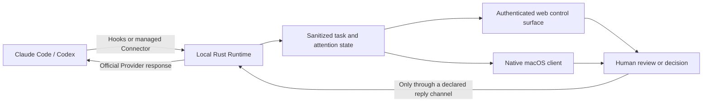

# ActRealm

[English](README.md) | [简体中文](README.zh-CN.md)

> Manage agents in one place. Bring the right task context forward.

ActRealm is an open agent operating layer for desktop. It brings task state,
approval requests, usage limits, and human handoffs from Claude Code and Codex
into one local control layer—so you can keep working while agents run, then
return to the right context when judgment is required.

ActRealm does not replace macOS or the underlying agent tools. It adds the task
and control model that desktop agents need: visible state, explicit authority,
and a safe path back to the work.

[Website](https://www.getactrealm.com) ·
[中文使用教程](docs/USER_GUIDE_zh-CN.md) ·
[Current status](docs/STATUS.md) ·
[Native client architecture](docs/NATIVE_CLIENT_ARCHITECTURE.md)

> **Project status:** functional implementation is complete through M14 plus
> post-M14 live-state and controlled Runtime-recovery refinements, but the
> current source remains a local test candidate rather than a final v1 release.
> A further usage/OAuth hardening change has passed its automated/resource
> gates and still requires exact-candidate local installation and user
> acceptance.
> Real-Provider M13 acceptance and the continuous 48-hour Runtime stability
> gate are still pending.

## A different operating model for agent work

Traditional operating systems organize applications, windows, files, and
device permissions. Agents introduce another unit of work: a task that can keep
running, wait for input, request authority, and return with a result.

ActRealm organizes that loop around four principles:

1. **A task is the unit of work.** Claude Code, Codex, and future adapters keep
   their own execution state and Provider-native behavior.
2. **Agent work remains observable.** Running, waiting, blocked, and completed
   tasks become visible local state instead of something you repeatedly hunt
   for across windows.
3. **Interruption matches risk.** Routine updates stay quiet; decisions carry
   concise context; high-risk actions return you to the original interface for
   verification.
4. **People retain authority.** ActRealm only offers a direct action when the
   Runtime owns a live, official reply channel. It never invents approval state.

## What works today

The current build includes:

- **Claude Code and Codex integration** through local Hooks and an explicit,
  version-gated Codex app-server Connector;
- **an honest first-run workspace and unified Agent setup center** that detects
  CLI/Desktop installations, performs real backup-preserving install, repair,
  refresh, and uninstall actions, and keeps Codex trust user-controlled;
- **one task overview** for Provider state, current activity, wait time,
  questions, approval requests, completion, and quota status;
- **Provider-lifecycle projection** for structured Claude/Codex plans,
  deterministic turn-completion Attention, Codex auto-review ownership, and
  live Claude/Codex sub-Agent activity;
- **Codex internal-session filtering** that removes known App-generated
  overview/safety background work at Runtime ingest while preserving ordinary
  user sessions, fail-open behavior, and aggregate metrics truth;
- **a capability-aware approval loop** with risk labels, allow/deny/pass-through
  where supported, and a three-second undo window before a decision commits;
- **honest return-to-task behavior** that reports the best available level:
  exact Codex conversation, matching Terminal/iTerm session, application only,
  or unsupported;
- **truthful degradation** when plan details, tool events, reply capability, or
  quota readings are unavailable or stale;
- **privacy-bounded live usage context** with cumulative Token, current-turn
  context occupancy, an explicitly labelled API-price estimate, and background
  Claude OAuth quota refresh with local fallback;
- **bounded usage and credential resilience** with current-picker versus
  historical per-source offline pricing, structured model fallback,
  incremental transcript compaction, fixed-first Keychain lookup, and
  official-CLI OAuth expiry recovery when a Claude CLI is available;
- **an authenticated local control surface** backed by a single Rust Runtime,
  SQLite persistence, WebSocket updates, diagnostics, and local export;
- **stable live updates and controlled recovery** with heartbeats, stale-channel
  fallback, in-place elapsed-time updates, a local health monitor, and a
  one-button same-port Runtime restart;
- **a native macOS client codebase** with menu-bar UI, HUD, Runtime supervision,
  and experimental foreground scheduling.

The product, Runtime executable, and CLI all use the name **ActRealm**
(`actrealm` on the command line).

## How the control loop works



The Rust Runtime is the single owner of Hooks, SQLite, sanitization, approval
state, and Provider replies. Web and native clients consume the authenticated
loopback API and WebSocket; they do not open the Runtime database directly.

When an approval exists only inside a Provider's native interface, ActRealm
shows the waiting state and guides you back to that interface. It does not show
fake allow/deny controls or infer the eventual outcome.

## Run the current build from source

Requirements:

- macOS;
- Git;
- Rust stable 1.85 or newer;
- at least one local Provider: Claude Code CLI/Desktop or Codex CLI/Desktop.

The active product implementation currently lives on `agent/v1-full`, so clone
that branch explicitly:

```bash
git clone --branch agent/v1-full https://github.com/Frontier-Interfaces/ActRealm.git
cd ActRealm
cargo build --workspace --release
```

Install only the Provider integrations present on your machine:

```bash
./target/release/actrealm install-hooks claude
./target/release/actrealm install-hooks codex --enhanced-codex-activity
```

Then keep the Runtime running in its own terminal:

```bash
./target/release/actrealm serve --open
```

`serve --open` starts the local Runtime, opens the authenticated control page on
a random `127.0.0.1` port, and keeps the WebSocket/control loop alive. Do not
reuse an old localhost URL after the process exits.

Codex requires a separate user-controlled trust step: open a new local Codex
session, run `/hooks`, inspect the exact commands, and trust them yourself.
ActRealm never bypasses that review. After starting a fresh Provider session,
verify the complete path from another terminal:

```bash
~/.actrealm/bin/actrealm doctor
```

Installation is complete only when the stable helper exists, the Runtime
control loop is reachable, the selected Hooks are installed and trusted, and a
real event from a new local Provider session reaches the UI. See the
[Chinese installation guide](docs/USER_GUIDE_zh-CN.md) for the full acceptance
checklist and recovery steps.

## Native macOS client

The SwiftUI/AppKit client lives in `apps/macos/` and packages the repository's
Rust Runtime as `ActRealm.app/Contents/Helpers/actrealm`.

```bash
apps/macos/Scripts/test.sh
apps/macos/Scripts/package-app.sh
open apps/macos/dist/ActRealm.app
```

The current native UI uses Swift tools 6.2 and macOS 26 APIs and currently
targets Apple Silicon. Local packages remain ad-hoc signed QA artifacts. The
repository now contains a Developer ID signing, notarization, stapling, DMG,
checksum, and GitHub release workflow, but a public installer is not considered
available until that workflow runs with release credentials and the resulting
DMG passes a clean-Mac install gate.

## Current boundaries and roadmap

| Area | Status | Boundary |
| --- | --- | --- |
| Local Runtime and web control surface | Current test candidate | Functional through M14 plus live-state/recovery refinements; M13 real-Provider acceptance and the 48-hour soak remain open |
| Claude Code and Codex | Current build | Local sessions only; direct actions depend on the actual reply channel |
| Native macOS client | Testable source | macOS 26+ on Apple Silicon; local packaging works, while clean-Mac release acceptance remains open |
| Automatic ActRealm Workspace arrangement | Experimental | Requires macOS Accessibility permission and must fail without changing Runtime state |
| ActRealm Review | In development | Planned test, diff, evidence, and checkpoint review; not part of the current build |
| Gemini CLI adapter | In development | Not shipped as a current supported Provider |
| Windows client | Roadmap | Runtime platform abstractions must land before the WinUI shell |
| Public signed installer | Release-gated | Pipeline exists; Developer ID/notarization credentials and clean-Mac acceptance are still required |

Roadmap-tagged capabilities on the website are target experiences, not evidence
of shipped behavior. The detailed implementation and release truth lives in
[`docs/STATUS.md`](docs/STATUS.md).

## Repository layout

```text
ActRealm/
├── crates/             Rust Runtime, Provider adapters, server, and CLI
├── web/                Embedded local web control surface
├── apps/
│   ├── macos/          SwiftUI/AppKit client
│   └── windows/        Windows architecture plan
├── shared/contracts/   Stable cross-platform client contracts
├── fixtures/           Sanitized Provider Hook fixtures
└── docs/               Status, acceptance, architecture, and verification
```

Native clients remain platform-specific. They share contracts and terminology,
not UI code or a second copy of the Runtime.

## Local quality gate

Before a milestone commit:

```bash
cargo fmt --all -- --check
cargo clippy --workspace --all-targets --offline -- -D warnings
cargo test --workspace --offline
cargo build --workspace --release --offline
./scripts/check-actrealm-language.sh
./scripts/m0-e2e.sh
./scripts/m5-resource-check.sh target/release/actrealm
apps/macos/Scripts/test.sh
```

Acceptance records are kept under `docs/` so implementation claims can be
checked against tests, manual Provider evidence, and release gates.

## Privacy and trust

ActRealm is local-first:

- no ActRealm account;
- no required cloud backend;
- no telemetry or automatic metrics upload;
- authenticated loopback-only control surfaces;
- sanitized persistence and explicit local export;
- raw prompts, transcripts, source files, URLs, tokens, and full paths excluded
  from diagnostic capture.

The underlying Claude Code, Codex, or future Provider still follows its own
configuration and service terms. ActRealm's local-first boundary does not
change how those tools handle data.

## Documentation

- [Current development and release status](docs/STATUS.md)
- [Chinese installation and usage guide](docs/USER_GUIDE_zh-CN.md)
- [Native macOS/Windows architecture](docs/NATIVE_CLIENT_ARCHITECTURE.md)
- [Executable v1 acceptance contract](docs/V1_ACCEPTANCE.md)
- [M14 live usage, context, price, and quota evidence](docs/M14_USAGE_CONTEXT_QUOTA.md)
- [Post-M14 live-state and Runtime-recovery evidence](docs/POST_M14_REALTIME_RECOVERY.md)
- [Post-M14 usage, pricing, and OAuth hardening](docs/POST_M14_USAGE_OAUTH_HARDENING.md)
- [Post-M14 first-run onboarding and setup center](docs/POST_M14_FIRST_RUN_ONBOARDING.md)
- [Post-M14 Codex internal-session filtering](docs/POST_M14_CODEX_INTERNAL_SESSION_FILTERING.md)
- [Development plan](docs/WIDGET_V1_PLAN.md)
- [Development changelog](CHANGELOG.md)
- [Third-party notices](THIRD_PARTY_NOTICES.md)

## Contributing

Issues and focused pull requests are welcome. Please preserve the local-first
trust boundary, keep Provider capability claims evidence-based, and add or
update compatibility tests whenever a Runtime contract changes.

## License

[MIT](LICENSE)
