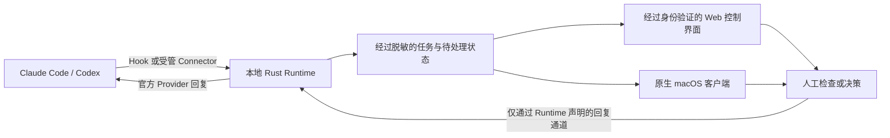

# ActRealm

[English](README.md) | 简体中文

> 统一管理 Agent，按需调度任务现场。

ActRealm 是桌面端的开源 Agent 操作层。它把 Claude Code 与 Codex 的任务状态、
授权请求、使用额度和人机交接统一纳入本地控制——平时让 Agent 在后台继续执行，
需要判断时，再把你带回正确的任务上下文。

ActRealm 不替代 macOS，也不替代底层 Agent 工具。它补上桌面 Agent 所需要的
任务与控制模型：让状态可见、权限明确，并为人保留一条安全返回工作现场的路径。

[产品官网](https://www.getactrealm.com) ·
[中文使用教程](docs/USER_GUIDE_zh-CN.md) ·
[当前开发状态](docs/STATUS.md) ·
[原生客户端架构](docs/NATIVE_CLIENT_ARCHITECTURE.md)

> **项目状态：** 功能实现已经推进到 M14，并包含后续的实时状态与 Runtime
> 受控恢复优化，但当前源码仍是供本地测试的候选版本，不是最终 v1 Release。
> 后续的用量与 OAuth 加固已经通过自动化及资源门禁，仍需精确安装候选版本并由
> 用户本机验收。
> M13 真实 Provider 验收和连续 48 小时 Runtime 稳定性门禁仍未完成。

## 为 Agent 工作建立新的操作模型

传统操作系统围绕应用、窗口、文件和设备权限建立。Agent 带来了另一种工作单元：
一个任务可以持续执行、等待输入、请求权限，并带着结果返回。

ActRealm 用四条原则组织这个闭环：

1. **任务成为工作单元。** Claude Code、Codex 和未来的适配器继续保留各自的
   执行状态与 Provider 原生行为。
2. **Agent 工作变成可见状态。** 运行、等待、阻塞和完成不再散落在不同窗口中，
   而是成为可以统一查看的本地状态。
3. **打扰强度由风险决定。** 普通更新保持安静；需要判断时提供简洁上下文；
   高风险操作必须回到原始界面核验。
4. **人保留最终权限。** 只有 Runtime 拥有真实、有效的官方回复通道时，ActRealm
   才提供直接操作；它不会虚构批准能力或审批结果。

## 当前已经可以运行的能力

当前构建包括：

- **Claude Code 与 Codex 接入**：通过本机 Hook，以及显式启用并经过版本门禁的
  Codex app-server Connector；
- **统一任务总览**：集中显示 Provider 状态、当前活动、等待时间、问题、授权请求、
  完成状态和额度信息；
- **能力感知的审批闭环**：在真实支持的场景中提供风险提示、允许、拒绝、交还原界面，
  并在决策正式提交前保留 3 秒撤回时间；
- **诚实的任务返回能力**：明确报告当前能够达到的层级——精确 Codex 会话、匹配的
  Terminal/iTerm 会话、仅打开应用，或暂不支持；
- **缺失信息诚实降级**：计划详情、工具事件、回复能力或额度信息缺失、过期时，
  明确显示不可用，而不是用推断补齐；
- **受隐私边界约束的实时用量信息**：显示累计 Token、本轮上下文占用、明确标注的
  API 价格估算，并在后台刷新 Claude OAuth 额度；失败时保留本地有效值；
- **有界的用量与凭据恢复**：区分当前可选与历史模型的来源标注离线价格、用
  transcript/rollout 结构化模型补全任务卡、增量压缩 transcript、优先直查
  Keychain 固定服务，并在存在 Claude CLI 时委托官方 CLI 恢复临近过期的 OAuth；
- **经过身份验证的本地控制界面**：由单一 Rust Runtime 提供 SQLite 持久化、
  WebSocket 更新、诊断和本地导出；
- **稳定实时刷新与受控恢复**：提供心跳、失活连接回退、原位时间更新、本机健康
  监控和保持端口不变的一键 Runtime 重启；
- **原生 macOS 客户端代码**：包含菜单栏、HUD、Runtime 监管和实验性的台前调度。

产品、Runtime 可执行文件和 CLI 全部使用 **ActRealm** 这一名称；命令行形式为
`actrealm`。

## 控制闭环如何工作



Rust Runtime 是 Hook、SQLite、脱敏、审批状态和 Provider 回复的唯一所有者。
Web 与原生客户端只使用经过身份验证的本机 API 和 WebSocket，不会直接打开或修改
Runtime 数据库。

如果某个授权请求只存在于 Provider 自己的界面中，ActRealm 只同步等待状态并引导
你返回原界面，不会显示虚假的允许/拒绝按钮，也不会推断用户最终执行了什么操作。

## 从源码运行当前版本

使用前需要：

- macOS；
- Git；
- Rust stable 1.85 或更高版本；
- 至少一个本机 Provider：Claude Code CLI/Desktop 或 Codex CLI/Desktop。

当前产品实现位于 `agent/v1-full`，因此需要明确克隆这个分支：

```bash
git clone --branch agent/v1-full https://github.com/Frontier-Interfaces/ActRealm.git
cd ActRealm
cargo build --workspace --release
```

只安装本机实际存在的 Provider。以下两个命令按需选择，不要求全部执行：

```bash
./target/release/actrealm install-hooks claude
./target/release/actrealm install-hooks codex --enhanced-codex-activity
```

然后在一个独立终端中持续运行 Runtime：

```bash
./target/release/actrealm serve --open
```

`serve --open` 会启动本地 Runtime，在随机的 `127.0.0.1` 端口打开经过身份验证的
控制页，并维持 WebSocket 和控制闭环。进程退出后不要继续使用旧的 localhost 地址。

Codex 还需要用户亲自完成信任：打开一个新的本机 Codex 会话，执行 `/hooks`，检查
每条具体命令并确认信任。ActRealm 不会绕过或替用户完成这一步。随后启动一个新的
Provider 会话，并在另一个终端中验证完整链路：

```bash
~/.actrealm/bin/actrealm doctor
```

只有稳定 helper 已生成、Runtime 控制闭环可达、所选 Hook 已安装并完成信任，且
新的本机 Provider 会话产生的真实事件已经到达界面，才算安装完成。完整验收清单和
故障恢复方式见[中文安装与使用教程](docs/USER_GUIDE_zh-CN.md)。

## 原生 macOS 客户端

SwiftUI/AppKit 客户端位于 `apps/macos/`，打包时会把仓库根目录构建出的 Rust
Runtime 放入 `ActRealm.app/Contents/Helpers/actrealm`。

```bash
apps/macos/Scripts/test.sh
apps/macos/Scripts/package-app.sh
open apps/macos/dist/ActRealm.app
```

当前原生界面使用 Swift tools 6.2 和 macOS 26 API。生成的 App 仅用于本地开发，
采用 ad-hoc 签名；目前还没有经过公证、可公开下载的安装包。

## 当前边界与路线图

| 范围 | 状态 | 能力边界 |
| --- | --- | --- |
| 本地 Runtime 与 Web 控制界面 | 当前测试候选版 | 功能实现到 M14 并包含实时状态/恢复优化；M13 真实 Provider 验收和 48 小时稳定性门禁仍待完成 |
| Claude Code 与 Codex | 当前构建 | 只覆盖本机会话；直接操作取决于事件是否带有真实回复通道 |
| 原生 macOS 客户端 | 可测试源码 | 已能在本地打包；台前调度与窗口激活仍需更广泛的人工验收 |
| ActRealm 工作区自动排布 | 实验性能力 | 需要 macOS 辅助功能权限，失败时不得修改 Runtime 任务状态 |
| ActRealm Review | 开发中 | 规划包含测试、diff、证据与检查点审阅；不属于当前构建 |
| Gemini CLI 适配器 | 开发中 | 尚未作为当前正式支持的 Provider 交付 |
| Windows 客户端 | 路线图 | 必须先完成 Runtime 平台抽象，再开发 WinUI 客户端 |
| 公开签名安装包 | 路线图 | 当前不承诺可下载的 M1 安装包 |

官网中标记为 Roadmap 的内容属于目标体验，不代表已经交付。详细的实现与发布事实
以 [`docs/STATUS.md`](docs/STATUS.md) 为准。

## 仓库结构

```text
ActRealm/
├── crates/             Rust Runtime、Provider 适配器、Server 和 CLI
├── web/                嵌入二进制的本地 Web 控制界面
├── apps/
│   ├── macos/          SwiftUI/AppKit 客户端
│   └── windows/        Windows 架构规划
├── shared/contracts/   稳定的跨平台客户端契约
├── fixtures/           经过脱敏的 Provider Hook 测试数据
└── docs/               状态、验收、架构和验证记录
```

原生客户端保留各平台自己的实现。Mac 与 Windows 共享契约和术语，不共享 UI 代码，
也不会各自复制一份 Rust Runtime。

## 本地质量门禁

每个里程碑提交前运行：

```bash
cargo fmt --all -- --check
cargo clippy --workspace --all-targets --offline -- -D warnings
cargo test --workspace --offline
cargo build --workspace --release --offline
./scripts/check-actrealm-language.sh
./scripts/m0-e2e.sh
./scripts/m5-resource-check.sh target/release/actrealm
apps/macos/Scripts/test.sh
```

验收记录保存在 `docs/`，用于把产品能力声明与自动测试、真实 Provider 证据和发布
门禁逐项对应。

## 隐私与信任边界

ActRealm 默认本地运行：

- 不要求 ActRealm 账号；
- 不依赖云端后台；
- 不包含遥测或自动上传指标；
- 控制界面只通过经过身份验证的本机回环地址访问；
- 数据经过脱敏后在本地持久化，并由用户主动导出；
- 临时诊断不会记录原始提示词、对话、源文件、URL、Token 或完整路径。

底层 Claude Code、Codex 或未来 Provider 仍遵循各自的配置与服务条款。ActRealm 的
本地优先边界不会改变这些工具自身处理数据的方式。

## 文档

- [当前开发与发布状态](docs/STATUS.md)
- [中文安装与使用教程](docs/USER_GUIDE_zh-CN.md)
- [原生 macOS/Windows 架构](docs/NATIVE_CLIENT_ARCHITECTURE.md)
- [v1 可执行验收标准](docs/V1_ACCEPTANCE.md)
- [M14 实时用量、上下文、价格与额度验证](docs/M14_USAGE_CONTEXT_QUOTA.md)
- [Post-M14 实时状态与 Runtime 恢复验证](docs/POST_M14_REALTIME_RECOVERY.md)
- [Post-M14 用量、价格与 OAuth 加固](docs/POST_M14_USAGE_OAUTH_HARDENING.md)
- [开发计划](docs/WIDGET_V1_PLAN.md)
- [开发变更记录](CHANGELOG.md)
- [第三方声明](THIRD_PARTY_NOTICES.md)

## 参与贡献

欢迎提交 Issue 和范围清晰的 Pull Request。请保持本地优先的信任边界，用可验证证据
支持每项 Provider 能力声明，并在 Runtime 契约变化时同步增加或更新兼容性测试。

## License

[MIT](LICENSE)
