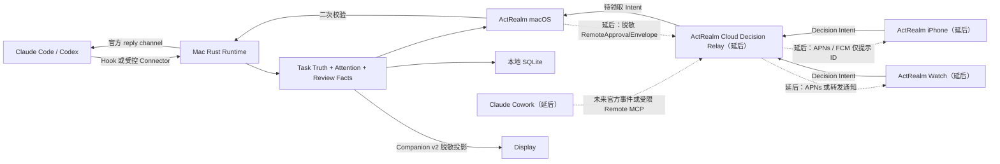

> 历史计划：团队、云分享和移动端范围已于 2026-09-16 移除；当前范围见 STATUS.md。

# ActRealm 本地 Agent 人类控制平面完整升级计划

> 2026-08-25 产品自检发现审批策略、首页信息层级、Token 可信呈现、历史噪音和资源占用仍需
> 重构。本文件保留 H0–H7 的历史工程路线；当前问题清单、P0 修复进度和后续执行顺序以
> `ACTREALM_PRODUCT_REFRAME_EXECUTION_PLAN_2026-08-25.md` 为准。H8 Display 继续冻结。

日期：2026-08-18

适用分支：`agent/runtime-v2-agent-observability`

基线：ActRealm `0.1.0 (59)`，提交
`f3e1e3689995432f0d4384f4206cd9fdd7a722e4`，Runtime SQLite schema 30

状态：**Implementation in progress；H0/H1/H2/H4/H5已通过，下一阶段H3；未授权云端部署或App Store发布**

2026-08-18 build 69 实机验收返工已由 build 70 通过：Review 新 Turn 刷新、桌面环境
上下文标题过滤、跨 Turn 嵌套仓库关联与 Token 仪表板时钟重绘已修复，并通过自动化门与
真实 Computer Use 回归。证据见
`docs/reports/ACTREALM_BUILD70_REAL_UI_REWORK_2026-08-18.md`。

## 1. 产品结论

ActRealm 下一阶段不再以“增加日志、图表或 Agent 动画”为主要方向，而要升级为：

> **本地 Agent 的人类控制、验收与恢复平面。**

它必须让用户不用先翻终端，就能准确回答五个问题：

1. 现在谁正在运行，谁真正需要我处理？
2. Agent 实际修改了什么，哪些修改能归属于这个任务？
3. Agent 做过哪些验证，结果是通过、失败、未运行还是无法确认？
4. 当前信息来自哪里，是否实时，为什么缺失，ActRealm 是否真的有控制能力？
5. 我如何安全地批准、拒绝、继续、恢复、回退或归档这项工作？

本计划把以下能力纳入同一长期路线；其中明确标记“延后”的项目不属于当前交付范围：

- ActRealm Review v1；
- 任务事实可信度层；
- Attention 稳定性与正确会话跳转；
- 活跃任务和历史中心分离；
- 面向决策的 Token/额度信息；
- Checkpoint、会话与代码关联、恢复和回退；
- **iPhone 与 Apple Watch 远程审批（延后，不实施）**；
- **Claude Cowork 受限观察集成（延后，不实施）**；
- 分层诊断与安全恢复；
- 成熟语义向 Display 副屏同步。

用户于 2026-08-21 明确决定：iPhone、Apple Watch 和 Claude Cowork 均保留在路线图，
但当前不实施、不排期，也不作为 H7、Display 或当前发布候选的进入条件。未来只有重新获得
用户授权后才恢复阶段；恢复时仍必须从 TEST 纵向切片开始，不能直接按完整交付实现。

## 2. 与现有计划的关系

现有文档 `ACTREALM_DISPLAY_NEXT_EXECUTION_PLAN_2026-08-17.md` 继续记录 ActRealm 与
Display 的工程交付顺序、A3 资源门和 Display 自适应要求。本文件是更高优先级的产品升级
主计划，负责说明“下一步建设什么、为什么、做到什么程度才算完成”。

冲突时按以下顺序处理：

1. 本机 Runtime 数据边界、Runtime capability 和 Provider 官方 reply channel 是安全硬边界；
2. 本文件决定产品阶段和范围；
3. ActRealm → Display 文档决定双仓库实施与屏幕验收细节；
4. 旧路线图中的过时构建号、旧状态和已经完成的任务不得覆盖本文件的当前基线。

## 3. 本次范围与非目标

### 3.1 必须交付

- 一个真实可用的 Review 纵向切片，而不是静态设计稿；
- 每项重要事实的来源、新鲜度、可验证性和缺失原因；
- 本地 Review、Diff 摘要、测试证据、Commit/PR 和最终结果；
- 活跃任务与历史中心的明确生命周期；
- 可恢复、可解释、不暗中修改工作区的 Checkpoint；
- Mac Runtime 始终是 Provider 回复的最终执行者；
- Display 最终消费同一事实和控制结果，不形成第二套规则。

### 3.2 本次明确不做

- 完整复制 Langfuse、Phoenix、IDE、终端或 Kanban；
- 上传 Prompt、Transcript、Diff、完整命令、路径、文件内容、Token、费用或额度；
- 默认自动批准、YOLO、永久远程控制授权；
- 通过 AI 推算计划百分比、测试结果、剩余时间或任务是否完成；
- 让云函数、iPhone、Watch 或 Display 直接连接 Provider reply channel；
- 远程执行任意命令、任意文本回复或高风险 approve；
- 在 Review v1 稳定前实现“一键创建 Worktree 并启动 Agent”；
- 把 Team 协作功能带入 Display 或个人远程审批主流程。
- 当前不实施 iPhone、Apple Watch、远程审批 Cloud 链路或 Claude Cowork Connector；这些能力
  只保留设计和安全边界，不进入当前代码、部署、签名与验收门。

## 4. 不可破坏的产品与安全原则

1. **Runtime 是唯一任务事实和执行权威。** UI、云端和移动端不能自行判定 Provider 已继续。
2. **没有证据就不能写“已验证”。** 未看到真实测试结束事件或可信进程结果时，只能显示
   “未运行”或“无法确认”。
3. **来源等级代替 AI 信心分数。** 使用 authoritative、observed、derived、unavailable，
   不显示看似精确的 83% 可信度。
4. **控制能力逐请求声明。** 只有当前 live waiter、受支持协议、有效期限和 allowlist 同时
   成立时才显示按钮。
5. **远程点击只是 intent。** Mac 必须重新校验请求 ID、fingerprint、authority epoch、
   request revision、风险、期限、设备状态和本地 waiter。
6. **云端默认不知道内容。** notification、Firestore 和 Cloud Functions 只保存冻结 schema
   允许的类别、风险、脱敏 shape、动作和状态。
7. **拒绝比批准更宽。** high/unknown 风险可以远程 deny，但不能远程 approve。
8. **本地优先、可撤销、可回退。** 关闭云端或撤销设备不影响 Mac 本地使用。
9. **活跃、提醒、历史、停止和删除是五种不同语义。** 任何 UI 都不得混用。
10. **Display 后接入。** ActRealm 本地事实、Attention、Review、历史和诊断通过 H7 真实
    验收后才复制到 Display；延后的移动端、Watch 和 Cowork 不阻塞 Display。

## 5. 成功指标

### 5.1 用户结果

- 用户在不打开终端的情况下，90% 以上的已完成任务能判断“下一步是什么”；
- Review 卡中“测试通过”零误报；
- 需要用户处理的 Attention 从 Runtime 产生到可见的本机 p95 小于 1 秒；
- 活跃看板零历史任务回流、零运行任务误隐藏；
- 用户返回原会话的成功率和降级原因可统计。

### 5.2 正确性与安全

- 零原始 Prompt、完整命令、路径、Diff 或 Provider 凭据离开 Mac；
- 本地控制只对当前 live waiter 生效，过期或 capability 不匹配时失败关闭；
- Claude Cowork 不得冒充 Claude Code，也不得把模型自然语言当成测试或完成证据。

### 5.3 性能

- Review 数据在任务完成后增量生成，不全盘重复扫描 Git；
- 活跃首页不读取完整 Diff 和历史 Transcript；
- hover、任务切换、Review 展开无超过 100 ms 的可感知主线程停顿；
- H0 使用 10 分钟短时资源门；RSS 不应持续增长，SQLite 增长必须有界；长期结论留给 H9
  的 7 日 soak，不用 10 分钟结果冒充长期稳定。

### 5.4 延后候选指标（当前不适用）

只有用户重新启用对应阶段后，才恢复 iPhone/Watch 的远程可见 p95、撤销、fingerprint、
多设备 first-valid-wins、App Check 和零高风险 approve 指标；Claude Cowork 则必须先证明
稳定发现任务、零虚假完成、零重复、断线可见，并且不上传 Prompt、路径、命令或文件内容。
这些指标不属于当前 ActRealm + Display 发布门。

## 6. 目标架构

下图保留长期目标；标注“延后”的 Cowork、Cloud、iPhone 和 Watch 节点当前不实施。当前
交付闭环是 Provider → Runtime → ActRealm macOS → Display。



### 6.1 权威边界

| 层 | 可以做 | 不能做 |
| --- | --- | --- |
| Provider adapter | 解析官方事件和 reply channel | 猜测未来 Provider 行为 |
| Rust Runtime | reducer、事实存储、能力判定、最终回复 | 上传私密上下文 |
| macOS App | 展示、Git 本地检查、发布脱敏投影、领取 intent | 绕过 Runtime 回复 Provider |
| Cloud | 身份、设备、投影、排队、幂等、过期、审计 | 直接执行命令或读取本地数据库 |
| iPhone | 完整脱敏审批上下文、身份验证、intent、撤销 | 查看完整命令或 Provider 凭据 |
| Watch | 最小上下文、低/中风险确认、拒绝、返回 iPhone/Mac | 高风险批准、任意文本控制 |
| Claude Cowork | 未来只允许受限、明确来源的任务观察 | 冒充 Claude Code、读取内部缓存、宣称结构化测试或控制能力 |
| Display | 读取同一快照、受限 Attention 响应 | 建立第二套任务或风险 reducer |

## 7. 统一事实与证据模型

### 7.1 `FactEnvelope<T>`

每个重要字段不再只有值，还要携带：

```text
value
sourceKind        authoritative | observed | derived | unavailable
sourceID          connector / hook / transcript / process / git / runtime
capturedAt
freshness         live | delayed | stale | expired
verification      verified | partial | unverified | not_applicable
absenceReason     provider_not_supplied | not_supported | no_current_turn |
                  history_partial | permission_denied | source_stale | none
capability        direct | return_to_provider | observe_only | unavailable
```

规则：

- Provider 正式 plan、官方 approval waiter、测试进程退出码属于 authoritative；
- Hook 生命周期、进程状态和明确 Git 状态属于 observed；
- 安全标题回退、任务和 Git 变化的时间相关性属于 derived；
- derived 事实必须显示解释，不能升级成 authoritative；
- freshness 超过对应字段 SLA 后自动降级，不沿用绿色“实时”状态；
- UI 不直接解释 Provider 私有原始字段，只消费 Runtime 统一结果。

### 7.2 Review 证据对象

建议 Runtime/本地服务形成版本化 `TaskReviewSnapshot v1`：

- `sessionID`、`turnID`、`reviewRevision`；
- Provider、项目安全标签、任务安全标题；
- 任务开始/结束时间与结束原因；
- Git repository identity 的本地 opaque ID；
- branch、worktree identity、HEAD before/after；
- dirty before/after；
- changed file count、insertions、deletions；
- attribution：exact、bounded_window、concurrent_changes、unavailable；
- commit 列表和当前任务关联理由；
- PR URL 只在本地存储和展示；
- validation runs；
- final evidence：Provider completion、tests、build、lint、manual check；
- limitations 和 absence reasons；
- last meaningful action；
- generatedAt、source freshness、history completeness。

完整文件路径、Diff、命令、输出和 PR 私密信息仍只在用户点击后本地读取，不进入 Companion
或 Cloud snapshot。

### 7.3 Validation 状态机

```text
not_run -> running -> passed | failed | cancelled | timed_out | unverifiable
```

- `passed` 必须有退出码 0 或 Provider 官方结构化成功事实；
- 文本里出现 “tests passed” 不足以证明通过；
- 如果用户或另一个 Agent 同时修改工作区，Review 显示“存在并发修改，无法全部归因”；
- 重新运行测试产生新 validation run，不覆盖旧失败记录；
- Review 摘要以最新完成 run 为主，同时保留历史和时间。

## 8. 总体阶段与依赖

| 阶段 | 优先级 | 交付物 | 临时估算 | 进入下一阶段的门槛 |
| --- | --- | --- | ---: | --- |
| H0 | P0 | build 59 稳定性收尾 | 1–2 日 | 资源与睡眠唤醒无阻塞问题 |
| H1 | P0 | 事实可信度合同与 UI | 4–6 日 | 重要字段来源/缺失/能力准确 |
| H2 | P0 | ActRealm Review v1 | 7–10 日 | 20 个真实任务零虚假验证 |
| H3 | P0/P1 | Attention、活跃/历史分离 | 5–8 日 | 零误隐藏、零历史回流 |
| H4 | P1 | Token 决策信息 | 3–5 日 | 任务/项目归因诚实可复算 |
| H5 | P1 | Checkpoint 与恢复 | 6–10 日 | 恢复和回退不损坏用户改动 |
| H6 | Paused / TEST | iPhone + Watch 远程审批 | 已完成 A/B 代码门 | Team Admin APNs 权限后恢复真实设备门 |
| H6C | Deferred / TEST | Claude Cowork 受限观察源 | 未排期 | 先证明稳定事件源与零虚假完成 |
| H7 | P0 | 分层诊断和候选验收 | 4–6 日 | 用户确认 ActRealm 控制面满意 |
| H8 | P1 | Display 同步与自适应闭环 | 17–26 日 | 双端语义一致、真实副屏通过 |
| H9 | Release | 全平台 soak 与候选发布 | 7 日 soak | 发布门全部通过 |

估算为单人工程日，不是交付承诺；App Store 审核、证书、APNs 配置和真实设备发现的问题不
包含在编码估算内。每个阶段独立 commit、独立报告、独立回滚，不等待最后一次性合并。

## 9. H0 — 当前候选稳定性收尾

状态（2026-08-18）：**十分钟短时资源门与一次受控重启恢复通过。** 118 个真实负载样本中
三层 Token mismatch 为 0，Runtime RSS 峰值 23,232 KiB，SQLite 前后 integrity 均为
`ok`。真实物理睡眠/唤醒和长期结论按用户决定留给 H9；详细证据见
`docs/reports/ACTREALM_H0_SHORT_SOAK_2026-08-18.md`。

### 目标

确认 build 59 是可信升级基线，不把短时通过误写成长时间稳定。

### 任务

1. 运行 10 分钟真实 Codex/Claude 混合任务，采样 UI/Runtime CPU、RSS 和数据库大小；
2. 覆盖首次历史重建、追平、增量更新和 Models.dev 缓存刷新；
3. 做至少 5 次睡眠/唤醒、网络断开/恢复或 Runtime 重启；
4. 核对 canonical/daily/model 三层 Token 恒等式和 SQLite integrity；
5. 验证任务、Attention、额度、Review 空态和设置没有回归；
6. 记录资源基线、已知限制和失败恢复时间。

### 验收

- Runtime/SwiftUI RSS 无单调增长；
- 数据库增长可由新增事实解释；
- 睡眠期间不累计虚假执行时间；
- 重启不恢复失效 waiter；
- 历史扫描不发布中间前缀；
- 失败则先修基线，不进入 H1。

## 10. H1 — 任务事实可信度层

状态（2026-08-18）：**通过。** Runtime、Companion、macOS 和 Web 已接入五类
`SessionFacts v1`，真实 build 60 已验证运行/完成状态不会互相冒充。证据见
`docs/reports/ACTREALM_H1_FACT_TRUST_2026-08-18.md`。

### 目标

让用户先知道信息是否可信，再决定是否阅读更多信息。

### Runtime/合同

1. 定义 `FactEnvelope v1` 和 Provider capability matrix；
2. 当前计划、阶段、当前文件、动作、完成、测试和 Attention 全部携带来源元数据；
3. 任务完成、新 Turn、Provider reconnect 时清除不再当前的 plan/tool/current file；
4. 为每项空态提供稳定 `absenceReason`；
5. Snapshot/Companion 只传安全来源枚举和时间，不传原始 Provider payload；
6. 旧客户端缺少新字段时保持兼容，不把缺省解释成 verified。

### UI

- 每个模块可展开“来源与状态”；
- 默认只显示简短标记：实时、延迟、过期、无法验证；
- “0/5 步”必须来自真实 plan，未知显示“Provider 未提供计划”；
- “可直接处理”与“返回原应用”使用不同按钮和文案；
- 任务结束后 plan 显示最终快照或明确隐藏，不继续冒充当前流程。

### 验收

- Codex、Claude 各覆盖有/无 plan、有/无 current file、native/direct approval；
- Provider 字段删除、版本变化、断线、旧 snapshot 和时钟偏差有 fixture；
- 不允许出现“值存在但来源未知”的核心字段；
- 真实 dewu 类任务不能再出现 Provider 第1步而 ActRealm 第0步的矛盾。

## 11. H2 — ActRealm Review v1

状态（2026-08-21）：**H2.1–H2.4 全部通过，真实任务20/20。** build 64 已接入持久Turn baseline、
exact/bounded/concurrent归因、Commit计数和本地按需Diff/Patch；旧Turn补建baseline会明确标
late。build 72–75通过Computer Use修复Prompt信封/句号、Python测试分类、无退出码时的
unverifiable工作流、完成后并发Turn复算和历史时态。最终覆盖Codex/Claude Code、Git/非Git、
修改/无修改、测试实际通过/失败、linked worktree、嵌套/歧义仓库和并发修改，零虚假passed。
证据见`docs/reports/ACTREALM_H2_4_20_TASK_ACCEPTANCE_2026-08-21.md`。

### 目标

任务完成后，用户能在 ActRealm 内判断“改了什么、验证了什么、为什么可以结束”。

### 数据采集

1. Turn 开始时记录 repository/worktree/branch/HEAD/dirty 的本地基线；
2. 结束时增量读取 Git status、diff numstat、commit graph 和 validation facts；
3. 检测同一 worktree 的并发任务与外部修改；
4. exact attribution 只用于独立 worktree、明确 commit 或 Provider 结构化 change set；
5. 其他情况显示 bounded window 或 concurrent changes，不宣称所有变化都属于该 Agent；
6. 非 Git 项目仍展示验证和结果，但 Git 区域显示不可用原因。

### Review 卡

- 结果：完成、失败、取消、无法确认；
- 文件：变更数量、增删行、文件类型摘要；
- Git：branch、worktree、dirty、commit、PR；
- 验证：测试/build/lint/manual 的 passed/failed/not run/unverifiable；
- 依据：Provider completion、最后有效动作、退出事实；
- 限制：历史 partial、并发修改、权限不足、项目未知；
- 操作：查看本地 Diff、返回 Agent、继续修改、创建 Checkpoint、归档、删除历史。

### 隐私和性能

- 首页只保存/读取统计和状态；
- 点击 Diff 才读取具体内容；
- Diff 默认不上云、不进入通知、不进入 Display snapshot；
- 大仓库使用路径无关的 `--numstat`/状态增量和超时，不阻塞主线程；
- 二进制、大文件、submodule 和 LFS 显示类型/数量，不强行渲染。

### 最小真实验证

- 7 天内至少 20 个任务，Codex/Claude 均覆盖；
- 覆盖有修改、无修改、通过、失败、未测试、非 Git、并发修改和多个 worktree；
- 不允许一次虚假 `passed`；
- 用户不看终端也能给出继续、归档或返工决策；
- Review 生成不增加 Runtime 事件到 UI p95。

## 12. H3 — Attention、活跃面板与历史中心

状态（2026-08-21）：**H3 实现与精确提交 build 78 实机返工验收通过。** 已完成活跃/历史分离、
Runtime 持久化归档与历史删除、项目/Provider/模型/日期/状态/验证/分支筛选、按需 Review 与
Checkpoint 详情，以及“运行中不可归档、删除历史不停止 Provider/不修改 Git”的合同回归。
纯 Provider 生命周期记录不会进入历史中心，延迟旧事件不会导致任务回流。证据见
`docs/reports/ACTREALM_H3_HISTORY_LIFECYCLE_2026-08-21.md`。

### Attention

1. 排序固定为错误/阻塞、可操作审批、Provider 原生等待、问题、运行、完成；
2. 同级普通事件不重排；
3. 同时多个请求只聚焦一个，其余严格排队；
4. 提交动作后等待 Runtime/Provider continuation，不立即隐藏；
5. 跳转记录 exact conversation、terminal session、application only、unsupported 四级结果；
6. 远程和本地 Attention 共享 request identity，不能显示两份。

### 活跃面板

只包含：

- 运行中；
- 等待用户；
- 阻塞/错误；
- 刚完成且等待确认；
- 已完成但尚未到创建时确定的 `autoHideAt`。

“知道了”只清除提醒；“确认完成”是否隐藏由用户选择的模式决定；运行超过 30 分钟永远不
作为隐藏依据。

### 历史中心

- 按项目、Provider、模型、日期、状态、验证结果和 Git branch 搜索；
- 查看 Review、Checkpoint、最终结果和安全事件摘要；
- Provider 支持时跳回或恢复会话；
- 归档不停止 Provider，删除历史不删除 Git，停止任务不删除历史；
- 历史项不会因为新事件重新进入活跃面板，除非 Runtime 产生新的真实 Turn。

### 验收

- 6 个并发任务、5 个 Attention 连续处理无闪烁、重复、饥饿或焦点循环；
- 任务重启、continuation、完成确认和自动隐藏均有持久化回归；
- 删除/归档/隐藏/停止文案和实际副作用一致。

## 13. H4 — Token 与额度的决策信息

状态（2026-08-18）：**H4 通过，候选 build 67。** 已加入任务/项目可复算归因、
未分配 Token、真实5分钟燃烧速度、30分钟数值基线、本机阈值提醒和模块级显示设置；新明细
保持本机专用，不进入 Companion/Display 投影；真实 UI 验收发现并过滤了伪装成项目名的
Provider UUID。证据见
`docs/reports/ACTREALM_H4_TOKEN_DECISIONS_2026-08-18.md`。

### 目标

不再增加装饰性图表，只增加用户会据此采取行动的信息。

### 任务

1. 按任务和项目聚合 Token，同时显示归因覆盖率和未分配 Token；
2. 显示当前 Turn 和任务的短期燃烧速度，使用真实滑动窗口；
3. 检测异常突增，但只给数值和基线，不自动判断“浪费”；
4. 用户可设置本机阈值通知；
5. 官方额度、本地 Token、API 等价费用严格分区；
6. 显示来源、采集时间、价格版本、覆盖率和陈旧状态；
7. Display/Watch 只获得用户允许的摘要，不上传完整用量历史。

### 禁止

- 不能由本地 Token 判断 5x/20x；
- 不能把本地消耗映射成官方额度百分比；
- 不能用 total Token 猜 input/output 价格；
- 不能把 API 等价费用称为订阅账单；
- 不能把 Task attribution 不足的 Token 强行分给当前任务。

### 验收

- 任务/项目/总账可复算；
- 子 Agent、fork、compaction 和并发任务不重计；
- 阈值通知不会在历史回补时集中误报；
- 用户可以关闭每个新增模块。

## 14. H5 — Checkpoint、会话与代码恢复

状态（2026-08-18）：**H5 通过，候选 build 69。** 默认 metadata Checkpoint、
显式 stash-like Git 快照、Provider 恢复身份、历史 validation、三类独立恢复动作和强制 dry-run
已接入；不使用 destructive reset，不覆盖未知用户改动。真实 UI 已创建 metadata Checkpoint
并正确禁用不受支持的 Provider 恢复。H3 历史中心后续复用同一本机 API，当前入口位于活动
任务 Review。证据见
`docs/reports/ACTREALM_H5_CHECKPOINT_RECOVERY_2026-08-18.md`。

### 目标

把 Agent 会话、代码状态、验证证据和恢复动作安全地绑定起来。

### Checkpoint 类型

1. **Metadata checkpoint**：session/turn、branch、HEAD、dirty 摘要、Review revision；
2. **Git checkpoint**：用户明确授权后创建 commit 或 stash-like 可恢复对象；
3. **Provider checkpoint**：Provider 支持的 conversation/thread resume identity；
4. **Validation checkpoint**：当时测试和构建结果，不在恢复后继续冒充当前结果。

### 规则

- 默认只创建 metadata checkpoint，不自动 commit；
- 自动 commit/worktree 必须是独立设置并明确解释；
- 恢复前先做 dry-run，检测未提交改动、branch 漂移、缺失 worktree 和冲突；
- 恢复会话、恢复代码、回退代码是三个独立动作；
- 失败时保持原工作区，提供可复制诊断，不执行 destructive reset；
- Checkpoint 删除只删除 ActRealm 元数据，Git 对象按 Git 自己生命周期处理。

### 验收

- dirty worktree、独立 worktree、已提交、无 Git、branch 删除和冲突均覆盖；
- 恢复不会覆盖用户在任务结束后的新修改；
- Provider 会话无法恢复时诚实降级为打开应用或新会话；
- 成功恢复后旧 validation 标记为历史证据，新 Turn 重新验证。

## 15. H6 — iPhone 与 Apple Watch 远程审批

### 15.1 产品范围

状态（2026-08-21）：**H6-A/H6-B 代码门与开发 Cloud 部署已完成；用户决定在 Apple Team
Admin 权限处暂停，真实设备发布门仍未通过。** 恢复入口与逐项状态见
`docs/reports/ACTREALM_H6_PAUSE_HANDOFF_2026-08-21.md`。H6-B 新增私有 FCM endpoint、90 天
轮换 TTL、设备撤销
删除、独立 push rate limit、有限重试、失效 token 清理、冻结 opaque payload、通用锁屏文案、
iPhone 前后台重新拉取、FCM token 刷新以及 Watch iPhone-relay 边界。Functions 41/41、Rules
85/85、完整 Emulator、iOS source-check 和 4 项 Simulator 测试通过。开发 Firebase iOS App
`1:226935607548:ios:a14e12792480213b050779` 已注册；未创建或上传 APNs 私钥、未启用 production
App Check enforcement。提交 `596d68816510b53ef2e169e718966b865af904de` 的 Functions、Rules
与 indexes 已部署到 `actrealm-share-dev`，所有 H6 callable 为 Node.js 22、`ACTIVE`、min 0、
max 2，App Check 保持 monitor。Apple Developer 明确拒绝当前账号创建 Key，要求 Team Admin
授权；因此 APNs/FCM 到机与真实 iPhone/Watch 30 请求仍未验收，不能上线 approve。证据见
已移除的移动端历史实现记录 和
`docs/reports/ACTREALM_H6B_OPAQUE_PUSH_2026-08-21.md`。首版仍只处理 Runtime 明确标记为
`remoteActionable` 的 approval：

- iPhone：查看完整脱敏风险卡、approve/deny、三秒撤销、状态追踪、返回 Mac；
- Apple Watch：快速 deny、打开审核、低/中风险的二次确认 approve、状态追踪；
- native approval、question、error、completion 默认只通知或返回原应用，不伪造直接回复；
- high/unknown 只允许 deny 或“在 Mac/iPhone 查看”，永远不远程 approve；
- 默认关闭，用户逐台 Mac、逐台移动设备启用，可随时一键全部停用。

首版远程审批服务于同一用户自己的设备，不复用临时 guest share 作为长期个人控制关系。
现有 takeover share 的 request fingerprint、authority epoch、first-valid-wins、claim/resolve
和 Runtime revalidation 可以复用，但需要新增个人 `controlBinding` 生命周期。

### 15.2 平台方案

Apple 官方支持 iPhone 通知转发至 Watch、watchOS actionable notification，以及向独立
watchOS app 直接发送 APNs。Firebase 内置 App Check 当前不支持 watchOS target，因此首版
采用“iPhone 主端 + 依赖 iPhone 的 watchOS companion”结构，不能假装 Watch 已具备与
iPhone 相同的 Firebase 安全能力：

- H6-B APNs/FCM 只面向已验证 iPhone endpoint；系统可把同一条通用通知转发至配对 Watch，
  Watch 独立 token 必须等待 custom App Check 第二道门，不能提前登记；
- 系统负责最佳设备呈现和重复通知抑制，应用仍用 decision ID 去重；
- WatchConnectivity 用于配对、取回当前最小 envelope 和提交 Watch 确认；真正的 Cloud
  mutation 由持有 Firebase Auth 与 App Check 的 iPhone 完成；
- iPhone 不可达时，首版 Watch 只显示本机已缓存且仍在期限内的状态，并禁用 approve，
  允许稍后重试或提示返回 Mac；
- push 仅是唤醒提示，不是事实源；设备收到通知后必须重新读取当前状态。

独立 Watch 直连保留在 H6 内的第二道门，而不是移出计划：watchOS 9+ 的 App Attest API
可以作为自定义 attestation 的候选，但 Firebase 内置 provider 不可直接使用。必须先完成
Apple assertion → 自有验证端 → Firebase custom App Check token 的 threat model、原型和
重放测试；任何一环不通过，就维持 iPhone relay，不降低生产 App Check enforcement。

### 15.3 持久身份与账户迁移

当前 macOS Cloud 客户端主要使用匿名 Firebase Auth。长期远程控制不能依赖匿名身份，H6
必须先完成：

1. 增加 Sign in with Apple，使用随机 nonce 并由 Firebase 验证 Apple credential；
2. 现有匿名用户通过显式 consent 将身份 link 到 Apple credential，保留已有 shares/device；
3. Mac、iPhone 和 Watch 最终解析为同一 Firebase UID；
4. 禁止静默合并不同 UID，冲突时停止并提供恢复流程；
5. 支持退出、重新认证、账户删除、Apple token 撤销和 Firebase 数据删除；
6. 用户不登录时保留全部本地功能，但远程审批不可启用；
7. Sign in with Apple 失败或离线不得影响 Runtime、Review、历史和本地审批。

Watch 身份分两步：

- 默认由已登录 iPhone 发起一次性、短期 watch enrollment grant；
- Cloud 校验 iPhone 用户、设备凭据和绑定 nonce 后，为 Watch 建立独立 device registration；
- 首版 Watch 获得独立 device identity 和配对密钥，但 Cloud auth/App Check mutation 仍由
  iPhone 承担，不能复制 iPhone Firebase token 或 device credential；
- 独立直连通过第二道门后，Watch 才获得自己的短期 auth session、独立 256-bit credential
  和自定义 App Check token；
- 如果 Apple 平台登录体验和审核要求更适合独立 Sign in with Apple，则直连版本保留直接
  登录路径；
- 删除 iPhone 不自动删除 Watch，但 UI 必须提示仍存在的控制设备。

### 15.4 设备注册与凭据

扩展现有 `registerDevice/listDevices/revokeDevice`：

- platform：macOS、iOS、watchOS；
- device ID：随机 UUID，不使用硬件序列号或广告 ID；
- device credential：256-bit 随机值，只存本机 Keychain；Cloud 只存 SHA-256；
- label、app version、last seen、push capability、revokedAt；
- push token 存在服务端私有集合，不允许客户端列表接口返回；
- 每个设备独立撤销，撤销立即提升用户 `controlAuthorityEpoch`；
- 所有旧 pending intent 因 epoch 不匹配失效；
- 丢失手机时可在 Mac 一键撤销 iPhone 与 Watch；
- 提供“关闭所有远程审批”紧急开关，优先于单设备设置。

生产设备启用 App Check：iPhone 优先 Firebase App Check + App Attest，不支持时按经过
审核的 DeviceCheck 路径降级；Watch 首版不直接调用受 App Check 保护的 mutation，由 iPhone
relay。独立 Watch 只允许使用验证过的 custom App Check provider，不能因为 Firebase 内置
watchOS provider 不可用而绕过 enforcement。开发 ad-hoc/Emulator 使用明确 debug token，
不能把生产 enforcement 为了本地调试永久关闭。

### 15.5 `RemoteApprovalEnvelope v1`

允许离开 Mac 的字段冻结为：

```text
envelopeVersion
hostDeviceOpaqueID
taskOpaqueID
requestID
requestFingerprint
requestRevision
authorityEpoch
provider                 claude | codex
operationCategory        allowlisted enum
riskLevel                low | medium | high | unknown
commandShape             e.g. git <redacted>
riskReasonCodes          max 3 allowlisted codes
allowedDecisionActions   approve | deny
createdAt
undoWindowMillis
expiresAt
heartbeatAt
```

不允许：

- task 原始 Prompt；
- 完整命令和参数；
- 文件内容、路径、cwd、仓库 URL；
- tool input/output、Transcript、终端输出；
- Token、费用、额度和模型私密统计；
- Runtime bearer token、Provider credential、reply channel locator；
- 任意自由文本风险理由。

通知 payload 进一步缩小，只包含 opaque envelope ID、host ID、category ID、collapse ID 和
过期时间；锁屏默认文案为“ActRealm 有一项操作需要审核”。用户主动允许后，才可在解锁
设备显示 provider、风险和脱敏 command shape。

### 15.6 风险与动作政策

| 风险 | iPhone | Watch 通知 | Watch App | Mac |
| --- | --- | --- | --- | --- |
| low | approve / deny | deny / review | 二次确认 approve / deny | approve / deny / 原应用 |
| medium | 生物识别后 approve / deny | deny / review | 明确长按或二次确认 approve / deny | approve / deny / 原应用 |
| high | deny / 在 Mac 查看 | deny / review | deny / 在 Mac 查看 | 按 Runtime 能力处理 |
| unknown | deny / 在 Mac 查看 | deny / review | deny / 在 Mac 查看 | 按 Runtime 能力处理 |

补充规则：

- `creds.access`、`net.fetch_exec`、`shell.remove`、`file.delete`、`git.push` 默认至少 high；
- 风险 reducer 不能由移动端重算；
- 云函数按冻结 risk policy 再次检查 allowed actions；
- Watch notification 的第一个非破坏性动作不能是 approve，避免 Double Tap 误批；
- Watch 的 approve 必须进入 App 的明确确认页，不允许单次通知点击完成；
- iPhone approve 使用 LocalAuthentication；策略根据风险选择生物识别或设备所有者认证；
- deny 仍需要有效登录设备和请求状态，但可以比 approve 少一步交互；
- 用户不能创建“永远允许此类命令”的远程规则。

### 15.7 决策状态机

```text
open
  -> intent_submitted
  -> undoable
  -> claimable
  -> claimed_by_mac
  -> applied_to_runtime
  -> provider_confirmed

任何阶段可进入：cancelled | expired | superseded | rejected | delivery_failed
```

各状态语义：

- `intent_submitted`：Cloud 接受了用户意图，不表示 Mac 在线；
- `undoable`：三秒窗口内可撤销，Mac 不能提前领取；
- `claimable`：撤销窗口结束且请求仍有效；
- `claimed_by_mac`：绑定的 Mac 取得处理租约，尚未回复 Provider；
- `applied_to_runtime`：本地 Runtime 接受命令并进入 decision_sent；
- `provider_confirmed`：Provider 官方 continuation/resolved 信号到达；
- `delivery_failed`：Mac 未在 deadline 前领取；
- `rejected`：fingerprint、epoch、风险、设备、waiter 或 capability 校验失败；
- `superseded`：另一台设备或本地用户先完成有效决策。

移动端不能把 `intent_submitted` 或 `applied_to_runtime` 显示成“Agent 已继续”；只有
`provider_confirmed` 才显示 Provider 已确认。超过期限后不自动重试新请求。

### 15.8 端到端流程

1. Runtime 收到官方 managed approval，并确认 live waiter；
2. Runtime 计算 request fingerprint、风险、allowed actions 和 expiry；
3. macOS App 只在用户已启用远程控制时发布 envelope；
4. Cloud 验证 host device、schema、epoch、revision、risk policy 和 rate limit；
5. Cloud 保存 envelope 并用 APNs/FCM 发送 opaque notification；
6. iPhone/Watch 认证后按 ID 拉取当前 envelope；
7. 用户确认 action，设备提交 idempotency nonce 和 device proof；
8. Cloud 原子检查设备、epoch、expiry、revision 和 first-valid-wins，建立 undoable intent；
9. 三秒内用户可撤销；窗口结束后 intent 才能被 host Mac claim；
10. Mac 重新读取本地 Runtime snapshot，逐项比较 request ID/fingerprint/capability；
11. 校验通过后向本地 Runtime 提交，Runtime 再向官方 reply channel 回复；
12. Mac 写回 applied 或 rejected；Provider continuation 后再写 confirmed；
13. iPhone/Watch 收到状态更新，移除或保留失败原因；
14. 所有设备使用同一 decision ID 去重。

### 15.9 iPhone 应用范围

首版页面：

- 登录/账户迁移；
- Mac 与 Watch 设备列表、启用和撤销；
- 当前 Attention 列表；
- 审批详情卡；
- 三秒撤销和决策进度；
- 最近 30 天脱敏审批审计；
- 通知隐私、风险和远程控制设置；
- “在 Mac 打开”handoff；
- 紧急停用所有远程审批。

iPhone 不展示完整 Agent 历史、Token 仪表板、Diff 或终端；首版保持专注于判断和安全
控制。若没有 Mac heartbeat 或 request 即将过期，approve 入口禁用，允许 deny 或返回 Mac。

### 15.10 Apple Watch 应用范围

首版页面：

- 单个当前 Attention；
- 多请求数量和严格队列；
- provider、风险、operation category、脱敏 shape、剩余有效时间；
- deny；
- low/medium 的二次确认 approve；
- “在 iPhone 审核”和“在 Mac 处理”；
- submitted/undoable/applied/confirmed/failed 状态；
- 远程控制已停用或设备被撤销的明确空态。

首版 Watch approve 只有在配对 iPhone 可达、iPhone Firebase session/App Check 有效且请求
仍可操作时才启用。独立直连版本必须单独标记实验状态，不能与 relay 版本共用“已安全
连接”的 UI 状态。

Watch 不展示：

- 完整任务列表和历史中心；
- Diff、文件名、项目路径、命令参数；
- high/unknown approve；
- 自由文本问题回复；
- 永久授权规则。

布局使用大按钮、短句和风险颜色+图标双重编码；重要动作不依赖纯颜色。通知操作与 App
内部操作都必须测试误触、Double Tap、屏幕熄灭、腕上锁定和网络切换。

### 15.11 Cloud Functions 与存储

新增或演进的 callable API：

- `linkOwnerIdentity`；
- `createControlBinding`、`listControlBindings`、`revokeControlBinding`；
- `registerPushEndpoint`、`revokePushEndpoint`；
- `publishRemoteApprovalEnvelope`；
- `listRemoteApprovals`、`getRemoteApproval`；
- `submitRemoteDecisionIntent`；
- `cancelRemoteDecisionIntent`；
- `claimRemoteDecisionIntent`；
- `resolveRemoteDecisionIntent`；
- `disableAllRemoteControl`；
- `deleteAccountAndRemoteControlData`。

所有 mutation 继续通过 callable Functions；Firestore 客户端写入保持全拒绝。个人设备只
能读取自己 UID 下的最小 envelope 和自己的 decision 状态。push token、device credential
hash、rate limit、App Check 证据和审计内部字段不得客户端读取。

保留时限：

- open envelope：至 expiry + 最多 24 小时清理窗口；
- decision audit：默认 30 天，可由用户立即清除；
- push token：设备撤销立即删除；
- pending intent：过期立即不可执行；
- Cloud 不保留 Review、Diff、Token 或历史任务内容。

### 15.12 通知与后台策略

- push 唤醒后按 ID 拉取，不把 notification payload 当作事实；
- iPhone 和 Watch 使用相同 collapse/thread identity 去重；
- 普通 running/tool 事件不发 push；
- 只对 actionable approval、用户选择的问题/错误和最终决策状态发通知；
- background push 可能延迟或被丢弃，因此 App 打开时必须主动同步；
- Mac heartbeat 超时后 Cloud 停止生成可 approve 通知；
- 推送失败不改变请求状态；
- rate limit、指数退避和 token rotation 必须覆盖；
- production APNs key、Firebase server credential 只在受控 CI/Cloud 环境，不进仓库。

### 15.13 审计与用户可见性

本地和远程审计至少记录：

- opaque request/decision ID；
- provider、operation category、risk；
- actor device label 和 platform；
- submitted、undo、claim、apply、confirm、reject 时间；
- resolution code；
- authority epoch 和 envelope revision；
- 本地/远程来源。

审计不记录完整命令、路径或文件。用户可以从 Mac 查看详细本地事实，从 iPhone 查看脱敏
远程记录，从 Watch 只查看本次结果。

### 15.14 H6 测试矩阵

必须覆盖：

#### 身份与设备

- 匿名身份 link 成功、冲突、取消、离线；
- iPhone/Watch 注册、重复注册、credential 错误、撤销、重新配对；
- Apple token 撤销、Firebase session 过期、账户删除；
- 丢失手机后 Mac 紧急撤销；
- App Check monitor/enforced/debug 三种模式。
- Firebase built-in App Check 在 watchOS 不可用时必须走 iPhone relay；custom provider
  未通过时独立 Watch mutation 必须失败关闭；

#### 请求正确性

- low/medium/high/unknown；
- approve/deny、native-only、expired、malformed、future schema；
- request ID 正确但 fingerprint 错误；
- revision/epoch 变化；
- Runtime waiter 在提交后消失；
- Provider 已在原应用处理；
- Codex 支持版本和未来未知版本 fail closed；
- Claude/Codex 各至少一个真实可操作链路。

#### 并发与网络

- Mac、iPhone、Watch 同时点击；
- 两台 iPhone 或多块 Watch；
- 重复 push、乱序状态、Cloud retry、设备时钟错误；
- Mac 离线、Cloud 离线、iPhone 离线、Watch 离线；
- 撤销窗口内/后取消；
- claim 后 Runtime 崩溃；
- apply 后 Provider 无 confirmation；
- 网络恢复后不得执行已过期 intent。

#### UI 与可访问性

- 锁屏隐私、通知预览关闭、动态字体、VoiceOver、Reduce Motion；
- Watch 小屏、长文本、本地化、色盲和腕上锁定；
- Double Tap 不触发 approve；
- iPhone 生物识别失败、设备密码回退和取消；
- 状态不可达时按钮禁用并解释原因。

#### 安全测试

- Firestore Rules 全拒绝非法写；
- callable 越权、重放、nonce 复用、credential 猜测和 rate limit；
- push payload 无敏感字段；
- compromised guest share 不能升级成 owner controlBinding；
- revoked device、旧 epoch、旧 schema 和 unknown action 全部 fail closed；
- Cloud compromise 假设下仍无法直接回复 Provider，因为缺少本地 waiter 和 channel。

### 15.15 H6 真实验收门

- 至少 30 个真实远程请求：iPhone 20、Watch 10；
- Codex 和 Claude 均覆盖，能力不足时必须诚实降级；
- 至少 5 次 Mac 离线/睡眠、5 次移动网络切换；
- 至少 3 次多设备竞态；
- 至少 3 次设备撤销/重新配对；
- 零高风险远程 approve；
- 零重复 Provider 回复；
- 零过期或 fingerprint 不匹配执行；
- 零假 `provider_confirmed`；
- 用户可以在 Mac 一键关闭全部远程控制；
- 通过 Firebase Emulator、Rules、Functions、Swift、Runtime contract 和真实设备门后，才
  允许从 internal beta 扩大测试。

### 15.16 H6C — Claude Cowork 受限观察源

状态（2026-08-21）：**Deferred / TEST；保留路线，不实施、不排期。** 真实 Computer Use
验证表明：Claude Desktop 的 Code 模式会复用 Claude Code 引擎和 Hook，能够进入 ActRealm；
同一应用中的 Cowork 任务即使真实修改文件并运行测试，也不会产生当前 Claude Code Hook、
timeline 或 Review baseline，因此 Cowork 不能冒充现有 `claude` 能力。

未来若重新授权，必须作为独立 surface：

```text
provider: claude
surface: claude_cowork
source: cowork_remote_connector | desktop_observation
```

未来允许的首个切片只包含：用户允许的短标题、opaque task/workspace ID、started/running/
reported_completed/failed、时间、新鲜度、失联原因和“打开 Claude”。模型或 Connector 报告
必须标记 `model_reported` / `unverified`，不能直接形成 `passed`、Provider confirmed、当前
文件、精确工作流、exact Git 归因或审批能力。

禁止：

- 读取或反向工程 Claude Electron 内部数据库、缓存、网络 token 或完整会话；
- 把 Accessibility 文本当作后台权威事件源；
- 上传 Prompt、路径、完整命令、文件内容、Diff、Transcript、Token 或 Provider 凭据；
- 将 Cowork 的自然语言“测试通过”映射成结构化 validation；
- 因 Cowork 缺少本地 Hook 而扩大 Cloud、Connector 或文件访问权限。

恢复条件：用户再次明确授权；先用官方事件源或受限 Remote MCP 做 5 个真实任务的临时
可行性门，要求全部发现、零虚假完成、零重复、断网显示失联、敏感字段为零。若模型不能稳定
报告生命周期或无法绑定同一任务，则停止，只保留打开 Claude。H6C 不阻塞 H7、H8 或当前
H9 发布范围。

## 16. H7 — 分层诊断、恢复与 ActRealm 用户验收

状态（2026-08-25）：**实现、自动化门与精确候选实机 UI 验收通过；尚未取得用户最终产品
验收。** 精确提交 `5ddcfb0fbd24364c3e3a84163eaf0e195d004056` 已打包为 Apple Development
签名 build 81 并安装，Doctor overall/control loop/Claude/Codex real event 全部 pass。Runtime
`/api/v1/runtime/status` 升为冻结 schema v2，新增 commit/protocol/PID/启动
时间、Snapshot revision/新鲜度、SQLite schema/`quick_check`、Review/Token collector、
Companion scope 和不计为故障的 H6/Cowork 条件层。macOS 默认展示六层诊断及 Claude Code、
Codex、Cowork surface；原始 Runtime 输出折叠到技术详情，每层恢复动作不越权影响其他层。
Rust、server API、隐私 schema、Swift 解码与双语资源测试通过；实机确认 Token 首次扫描只使
Token 层变黄，其他健康层不被错误连带。证据见
`docs/reports/ACTREALM_H7_LAYERED_DIAGNOSTICS_2026-08-25.md`。H8 仍等待用户确认 H7 控制面满意。

### 诊断面板

展示：

- Runtime 版本、commit、协议、PID、启动时间；
- Hook/Connector、Provider version 和 capability；
- 最后事件、snapshot revision、新鲜度；
- Review collector、Git 检查、Token collector；
- SQLite schema/integrity 和 Companion scope；
- Claude Code/Codex surface 与 capability；Cowork 明确显示“不支持/未启用”；
- 只有未来恢复 H6/H6C 时，才追加 Cloud identity、移动设备、push、App Check、Cowork
  Connector 和最近远程 intent。

当前故障分层：Provider、Hook/Connector、Runtime、Git/Review、Companion、投影/UI。Cloud、
push、移动设备和 Cowork Connector 是未来条件层，不得在未实施时显示为当前故障。每层提供
只影响该层的安全恢复动作。

### 用户验收门

用户需要明确确认：

- Review 是否能代替大多数终端翻查；
- 来源/过期/缺失文案是否可信；
- 活跃/历史/隐藏/删除是否符合预期；
- Checkpoint 是否安全易懂；
- Token 决策信息是否有用且不误导；
- Claude Code/Codex 能力边界是否清楚，Cowork 是否诚实显示为当前未支持；
- 诊断是否能解释“为什么未连接”。

未通过时继续修 ActRealm，不提前把规则复制到 Display。延后的移动端、Watch 和 Cowork
不参与本轮 H7 结论。

## 17. H8 — Display 同步与副屏闭环

进入条件：H7 用户验收通过。

### 数据层

- 接入 Runtime/Companion v2 的 FactEnvelope、Review 摘要、Attention 和 autoHideAt；未来
  只有 H6 恢复并验收后才增加 remote decision state；
- wire snapshot → normalized/derived store → view state；
- 按 session/revision 增量更新，未变化卡片不重绘；
- Display 不重新计算风险、价格、验证或完成状态；
- 旧映射只有确认无消费者和迁移测试通过后才删除。

### 视觉原型

使用真实数据做三版交互 HTML：

1. Operations Desk；
2. Editorial Workspace；
3. Compact Rail。

三版共享事实和行为，只改变密度与视觉语言；在真实长条副屏和不同宽高比由用户选择。

### 交互

- 当前运行任务都保留；
- 点击聚焦任务后显示 plan、workflow 和 Review 摘要，其他任务缩小；
- 无 Attention 时 Outbox 不占空间；
- Attention 到来严格排队并聚焦；
- 处理后等待 Runtime confirmation 再收起；
- 工作流可滚动和分页，阅读旧事件时不强制拉到底；
- 当前不显示“在手机处理”或 Cowork 控制；未来对应阶段验收后再增加受限状态；
- 保留原 Agent 页面，看板从原入口进入。

### 自适应与性能

- horizontal strip、compact、standard、wide、portrait；
- 2880×864、1080p、16:10、超宽、窄竖屏、半屏；
- 100/125/150% 字体、中英文、Reduce Motion、色盲；
- 1/3/6 任务和 0/1/5 Attention；
- Instruments/Signpost 验证 derived update、卡片重绘、滚动和内存。

## 18. H9 — 全平台最终验收与发布候选

### 自动化

- Rust fmt、Clippy、workspace tests、release；
- macOS 全套 Swift tests；
- Runtime/Companion/Display schema contract、migration 和隐私 allowlist；
- `git diff --check`、Info.plist、entitlements、签名、架构；
- accessibility snapshot 和本地化合同。

iOS/watchOS、Firebase Functions/Rules/Emulator、Cloud/mobile schema、App Check 和 remote rate
limit 只有未来恢复 H6 时才加入对应候选门；Cowork Connector 只有恢复 H6C 时才加入。

### 真实 soak

- 7 天；
- 至少 30 个本地任务；
- 至少 20 个 Review；
- 至少 5 次睡眠/重启和 5 次网络切换；
- 当前长条副屏和至少两种不同宽高比；
- 记录 Attention 发现时间、终端打开次数、误打断、错误/重复/漏失决策、恢复时间、CPU、
  RSS 和数据库；延后功能未实施时不制造远程、Watch、Cowork 或 Cloud 样本。

### 发布条件

- 零严重状态矛盾；
- 零虚假测试通过；
- 零错误或重复控制；
- 零运行任务误隐藏；
- 零敏感字段泄漏；
- Cowork 不冒充 Claude Code，未支持 surface 不显示虚假计划、验证或控制；
- 用户确认 ActRealm 和 Display 确实减少上下文切换；
- Developer ID/notarization 和 clean-device 安装门通过；
- 未经用户明确授权不 tag、不建公开 Release、不部署生产 Functions/Rules。

## 19. 分支、提交与文档策略

建议阶段分支：

```text
agent/h1-trust-contract
agent/h2-review-v1
agent/h3-history-lifecycle
agent/h4-token-decisions
agent/h5-checkpoints
agent/h6-remote-approval-foundation
agent/h6-ios-client
agent/h6-watch-client
agent/h6c-cowork-observation
agent/h7-diagnostics
display/h8-control-plane
```

H6/H6C 分支名只是未来保留，不表示当前创建或排期。

规则：

1. 每阶段从已经通过上一阶段门的 commit 开始；
2. Runtime schema migration 必须可升级、可读取旧库、失败可回滚；
3. 只有恢复 H6/H6C 时才变更 Cloud schema；必须先向后兼容，再发布客户端，最后清理旧字段；
4. 未来 iOS/watchOS targets 与 Mac 共用 contracts/terminology，不复制 Runtime；Cowork 使用
   独立 surface 和能力矩阵，不复用 Claude Code 支持声明；
5. 每阶段更新 STATUS、用户指南、协议/schema、隐私边界、威胁模型和验证报告；
6. 云端部署、App Store/TestFlight、tag、Release 各自需要独立授权；
7. 不覆盖用户已有改动，不使用 destructive reset，不把构建产物提交到 Git。

## 20. 风险登记与止损条件

| 风险 | 早期信号 | 止损或降级 |
| --- | --- | --- |
| Review 归因错误 | 多任务共用 worktree | 降级 concurrent_changes，不展示文件归属结论 |
| 测试误报 | 只解析自然语言 | 只接受结构化结果/退出码 |
| 历史中心变成日志仓库 | 用户仍需翻大量事件 | 默认只显示 Review 和最终事实 |
| Checkpoint 覆盖用户改动 | restore 发现 dirty 漂移 | 只 dry-run，要求用户选择 |
| Cowork 冒充 Claude Code | Cowork 无 Hook 却显示计划/验证 | 独立 surface；当前显示不支持，停止集成 |
| Cowork 内部数据抓取 | 依赖 Electron 缓存或 Accessibility | 禁止正式实现；只等官方事件或受限 Remote MCP |
| Push 不可靠 | 通知延迟/丢失 | App 打开主动同步，push 不作为状态事实 |
| Watch 误触 | 单次点击 approve | 通知不提供 approve；App 二次确认 |
| 云端权限扩大 | schema 出现自由文本/路径 | CI allowlist 阻断，停止部署 |
| 多设备重复回复 | 两个 intent 同时 claim | 原子 first-valid-wins + Mac waiter claim |
| Mac 离线时假成功 | 手机只显示 submitted | 分离 applied/confirmed，超时 delivery_failed |
| Firebase 成本/滥用 | 调用量异常 | rate limit、App Check、billing alert、紧急停用 |
| Display 再次自建规则 | 双端状态不一致 | contract fixture 阻断发布 |

以下远程止损条件只在未来重新启用 H6 时生效；当前不运行远程 approve：

- 一次过期或 fingerprint 不匹配执行；
- 一次 high/unknown approve；
- 一次重复 Provider reply；
- 一次敏感字段进入 Cloud/notification；
- 无法在 Mac 撤销设备或紧急停用；
- Cloud 状态与 Runtime 最终结果无法对账。

## 21. 当前立即执行顺序

1. H2已完成；冻结Fact/Review/validation/并发归因合同，后续Provider变化必须通过同一fixture；
2. 完成 H3 活跃/历史分离、确认与自动隐藏语义、最小历史中心；
3. 完成 H7 本地分层诊断和用户验收；未实现的手机、Watch、Cowork 只显示“未启用”，不能
   形成当前故障；
4. H7 通过后实施 H8 Display 同步与自适应闭环；
5. 完成 ActRealm + Display 当前范围的 H9 七日 soak 后再讨论发布；
6. H6 iPhone/Watch 当前暂停；H6-A/H6-B 代码门与开发 Cloud 已完成。恢复时第一步不是重新编码，
   而是由 Apple Team Admin 开放 Key 权限或直接创建并配置开发 APNs，然后从 15.15 真实设备门
   继续。未通过前不扩大 approve。H6C Cowork 仍为延后候选。

下一项产品实现不是更多 Token 图表，也不是完整多 Agent Kanban，而是：

> **H6 暂停；恢复入口：Team Admin 开发 APNs → 真机安装 → iPhone/Watch 30 请求安全验收。**

## 22. 官方平台参考

- Apple：watchOS 可直接或经 iPhone 转发接收通知，并支持 actionable notification：
  <https://developer.apple.com/documentation/watchos-apps/enabling-and-receiving-notifications>
- Apple：watchOS 通知动作与设备处理位置：
  <https://developer.apple.com/documentation/watchos-apps/adding-actions-to-notifications-on-watchos>
- Apple：独立 watchOS app 不应依赖 WatchConnectivity 作为唯一数据源：
  <https://developer.apple.com/documentation/watchos-apps/creating-independent-watchos-apps>
- Apple：Sign in with Apple 与 Authentication Services：
  <https://developer.apple.com/documentation/authenticationservices>
- Firebase Apple 平台 SDK 与 watchOS 支持：
  <https://firebase.google.com/docs/ios/setup>
- Firebase Apple Sign in：
  <https://firebase.google.com/docs/auth/ios/apple>
- Firebase Cloud Messaging for Apple platforms：
  <https://firebase.google.com/docs/cloud-messaging/ios/get-started>
- Firebase：内置 App Check/App Attest provider 当前不支持 watchOS target：
  <https://firebase.google.com/docs/app-check/ios/app-attest-provider>
- Apple：watchOS 9+ extension 可检查并使用 App Attest，但必须验证设备支持：
  <https://developer.apple.com/documentation/devicecheck/dcappattestservice/issupported>
- Anthropic：Claude Desktop 的 Code 标签运行 Claude Code 引擎，本地会话复用 Claude Code
  settings 与 Hooks：<https://code.claude.com/docs/en/desktop>
- Anthropic：Cowork 任务运行在远端，并通过 Desktop 访问用户连接的本地文件：
  <https://support.claude.com/en/articles/13364135-use-claude-cowork-safely>
- Anthropic：Cowork 可使用远程 MCP Connector，但不提供本机 localhost MCP 作为同等链路：
  <https://support.claude.com/en/articles/11175166-get-started-with-custom-connectors-using-remote-mcp>

平台文档证明 API 可行，不替代本计划的安全、产品价值和真实设备验收。

## 23. 产品场景验证记录

### 23.1 Review 与事实可信度

**Verdict：BUILD；信心高；证据 E2。**

Normalized Scene：当同时运行多个 Codex/Claude 任务的开发者看到任务完成或等待处理时，
分散的终端、模糊的完成文案和缺失的验证证据迫使其逐个回到原应用核对；ActRealm 在关键
时刻展示来源明确的变更、验证和控制能力，使用户能决定继续、返工、恢复或归档，并以少
打开终端、零虚假验证和更快恢复作为结果。

| Hard gate | 结果 | 依据 |
| --- | --- | --- |
| 具体的人与时刻 | Pass | 当前用户真实并发运行 Codex/Claude，已反复遇到等待和完成判断 |
| 痛点/绕行/后果 | Pass | 已观察到反复返回终端、计划错位、旧流程残留和验证不清 |
| 产品必要性 | Pass | Runtime 持有跨 Provider 事实和 live waiter，普通 Git UI 不能闭合任务控制 |
| 端到端真实链 | Pass | Provider → Runtime → Review/Attention → 人 → Runtime 已有本地基础 |
| 人类控制 | Pass | 本计划保留来源、拒绝、原应用交回、恢复、隐私和 capability gate |
| 可衡量 | Pass | 终端打开次数、判断时间、虚假验证、恢复成功率和误隐藏均可记录 |

BUILD硬门已由20个真实任务满足：零虚假`passed`，错误来源均降级为unverifiable/ambiguous/
concurrent。是否减少打开终端次数继续在H7用户验收和H9 soak中观察；未改善时缩小Review，
而不是增加更多面板。

### 23.2 iPhone/Apple Watch 远程审批

**Verdict：TEST；信心中等；证据 E1；临时分数 71/100。**

Normalized Scene：当多 Agent 开发者离开 Mac 而一个受支持的 Agent 因低/中风险操作等待
时，返回电脑或使用完整远程桌面会延长阻塞并增加上下文切换；ActRealm 向已绑定的 iPhone/
Watch 发送最小化风险上下文，让用户拒绝、确认低风险操作或交回 Mac，并以减少 blocked
time、零错误控制和可见 Provider continuation 作为结果。

Evidence ledger：

- Observed：本机确有多任务、Attention、live waiter、延迟和原应用跳转问题；现有 Cloud
  takeover 已有 fingerprint、claim、resolve 和 default-deny 基础；
- Reported：用户曾要求纳入长期路线，并于 2026-08-21 明确要求保留但暂不实施；
- Inferred：离开 Mac 时远程处理可能显著减少 blocked time；
- Unknown：真实离桌审批频率、Watch approve 的反复使用率、通知打扰成本、网络和电量影响，
  以及远程桌面/仅通知是否已经足够。

| Hard gate | 结果 | 依据 |
| --- | --- | --- |
| 具体的人与时刻 | Pass | 多 Agent 开发者离开 Mac，Agent 出现有期限的真实 approval |
| 痛点/绕行/后果 | Partial | 阻塞和返回原应用真实存在，但尚无离桌审批事件日记和基线 |
| 产品必要性 | Partial | 安全的最小上下文和官方 reply channel 有优势，但需与普通通知/远程桌面对照 |
| 端到端真实链 | Partial | Mac/Cloud 基础存在，iPhone/Watch 真实闭环尚未实现 |
| 人类控制 | Pass（设计） | 风险门、拒绝、二次确认、撤销、过期、设备撤销和 Mac 二次校验已定义 |
| 可衡量 | Pass | blocked time、处理时间、误触、撤销、失败、重复、打扰和使用率可记录 |

临时评分（在真实测试后重算）：

| 维度 | 得分 |
| --- | ---: |
| 痛点证据 | 12/20 |
| 结果改善 | 10/15 |
| 产品必要性 | 10/15 |
| 端到端真实 | 10/15 |
| 战略契合 | 10/10 |
| 控制与信任 | 8/10 |
| 复发频率 | 3/5 |
| 沟通与证明 | 8/10 |
| **总计** | **71/100 — TEST** |

### 23.3 最小真实测试

最可能推翻场景的假设：用户离开 Mac 时确实反复需要处理 approval，而且 Watch 的有限上下文
足以做低/中风险判断，不会迫使用户继续打开远程桌面。

最小切片：

1. 只接一个真实 Codex managed approval 类别；
2. Mac 产生一个真实 `remoteActionable` envelope；
3. iPhone 收到 generic push，打开后显示脱敏上下文；
4. 用户 approve/deny，三秒撤销后由同一 Mac claim；
5. Runtime 回复真实 Provider，并显示 continuation；
6. Watch 第一版只做 deny、review 和打开 iPhone；确认价值后才开放 low/medium approve。

观察窗口和门槛均为**临时起点，不是统计证明**：

- 7 天，至少 10 个真实离桌 approval；
- 与“返回 Mac/远程桌面”基线比较 blocked time 和处理时间；
- 零错误、重复、过期或高风险执行；
- 至少 60% 的符合条件事件在移动端完成，且用户没有因为上下文不足再次打开 Mac；
- 每日非必要远程打扰不超过用户预先接受的阈值；
- 若安全正确但使用率低，降级为 retention 功能和通知/handoff；
- 若上下文不足或误触风险不可接受，Watch 保留 deny/handoff，不开放 approve；
- 只有端到端结果稳定后，才把 H6 从 TEST 提升为 BUILD。

### 23.4 沟通资格

- Review/可信度：`In development`，真实纵向切片通过后可作为高用户价值、高沟通价值的
  hero Scene；
- iPhone/Watch：当前为 `Deferred concept`，不能使用“随时从手腕安全审批 Agent”这类
  已交付表述；
- 可公开展示所需证据：真实 Mac waiter、真实 Watch/iPhone 动作、真实 Runtime apply、真实
  Provider continuation 和失败/撤销镜头必须在一条无剪接因果链中可验证。

### 23.5 Claude Cowork 受限观察

**Verdict：TEST；当前状态 Deferred；信心高；痛点证据 E2、集成证据 E0–E1；临时分数
68/100。**

Normalized Scene：当开发者让 Cowork 长时间处理已授权的本地文件时，反复打开 Claude
确认任务是否仍在运行或已经完成会增加上下文切换；ActRealm 未来只在有可信事件源时投影
受限状态，帮助用户发现完成、失败或失联并返回 Claude，不替代 Cowork 本身。

Evidence ledger：

- Observed：真实 Cowork 任务修改 2 个文件并运行 5 项测试，但 ActRealm 没有发现任务；同一
  Claude Desktop 的 Code 模式会产生 Claude Code Hook，并被 ActRealm 正确显示；
- Reported：用户要求将 Cowork 与 iPhone/Watch 一样加入后续路线，但暂不实施；
- Inferred：可靠的 Cowork 状态投影可能减少打开 Claude 的次数；
- Unknown：Anthropic 是否提供稳定的 Cowork lifecycle 事件、Remote MCP 模型调用是否足够
  确定、用户是否反复依赖该投影。

关键门：用户与痛点 Pass；产品必要性 Partial；端到端真实链 Partial；控制与隐私 Partial；
可衡量 Pass。没有官方 Hook 或稳定 Connector 前，不得升级为 BUILD。

未来最小测试仍是 5 个真实任务的受限 started/progress/reported_completed 投影；零虚假完成、
零重复、断线可见、敏感字段为零。当前成熟度为 `Deferred concept`，不能宣传“ActRealm 已
支持 Claude Cowork”。
