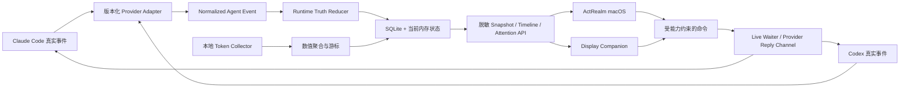

# ActRealm 后续产品与工程提升路线图

日期：2026-08-17

适用基线：`agent/runtime-v2-agent-observability`，起始提交
`81013262aa941bd6ff7aa529f720d9dd04825778`

当前成熟度：**In development**

> 2026-08-18 起，后续产品升级的权威主计划为
> `docs/ACTREALM_HUMAN_CONTROL_PLANE_UPGRADE_PLAN_2026-08-18.md`。本路线图保留市场证据、
> 场景验证和早期 R0–R6 决策记录；当状态或阶段排序冲突时，以新主计划为准。

## 1. 总结与决策

总体判断：**BUILD ActRealm 的状态真实性、注意力处理和恢复能力；TEST Display
副屏的真实闭环；继续完善 Token 统计但不把产品退化成单纯的 Token Monitor。**

ActRealm 的核心价值不是“显示更多信息”，而是让同时运行多个 Claude Code、Codex
任务的开发者在离开原终端后，仍能准确知道哪项工作在运行、哪项需要自己、采取动作
后是否真的继续，以及断线或 Provider 状态漂移后如何恢复。

Display 的独特价值必须由真实使用证明：持续显示可以减少上下文切换，并且只在需要人
时聚焦。仅仅把 ActRealm 页面搬到第二块屏幕，或者增加漂亮的 AI 动画，都不够成为
独立产品价值。

## 2. Normalized Scene

当同时运行多个 Claude Code 与 Codex 任务的开发者把注意力转移到其他工作时，终端和
主屏窗口分散会迫使其反复切换检查，造成等待遗漏、错误授权和上下文恢复成本；ActRealm
从真实 Provider/Runtime 事件形成可恢复的任务真相，Display 在不打断时持续呈现状态、
在需要判断时聚焦对应任务并把高风险动作交回完整上下文，使用户更快发现、判断、继续
并验证任务结果。

## 3. Evidence ledger

证据等级：**E2（已观察到问题与真实本地数据，但 Display 介入后的长期结果仍需验证）**

### Observed

- 当前安装的旧 Runtime 曾真实返回 `protocolVersion: 1`，而 Display 要求 v2，导致
  “未连接”；候选源码现已补入 v2，但还需要重新安装后的端到端验证。
- Runtime、macOS UI 和测试中已经存在真实的 session、turn、plan、tool、attention、
  token、quota 和 current-turn timeline 数据链路。
- 已有回归测试覆盖旧任务流程不得冒充当前流程、工作流分页与脱敏、任务排序、Token
  日聚合、热力图 hover、Spark/Pro 规则和 API 性能。
- 用户截图和多次反馈显示：任务标题过大、任务流程/工作流可读空间不足、Token 视觉
  过于单调、工作流全是 Bash 噪音、旧流程未及时消失以及副屏字体偏小。

### Reported

- 用户会同时运行多个 Agent，需要正在运行的任务持续显示；历史已停止任务不应占据
  副屏。
- 需要显示任务名称、项目、Agent 来源、模型、当前动作、Runtime、Token、当前文件、
  阶段、额度、时间、任务流程和工作流。
- Outbox 平时应隐藏；需要处理时自动聚焦，处理后消失；多个请求应稳定排队而不是同时
  抢占。
- 副屏尺寸会更换，布局不能绑定单一分辨率或固定宽高。
- ActRealm 原 Agent 页面应保留，Agent 看板是从原页面进入的独立工作面，而不是替换
  原入口。

### Inferred

- 持续副屏可能减少用户切换终端确认状态的次数，但尚未有对照数据。
- 当前任务和当前阶段 Token 对开发者有调试价值，但其日常决策价值可能低于等待、失败
  和恢复状态。
- 多 Provider 的统一事件模型可以降低后续接入成本，但 Cursor/OpenCode 等新 Provider
  是否值得立即支持仍未知。

### Unknown

- 真实长条副屏连续使用一周后，自动聚焦是否减少等待，还是造成更多打断。
- Claude Code 与 Codex 在版本升级后的事件字段漂移频率。
- 用户实际需要查看完整 prompt，还是安全的任务摘要已经足够。
- Token 图表中哪些细分会反复用于决策，哪些只是“看起来完整”。
- 长时间多任务、睡眠唤醒、线缆重连下的真实内存、CPU 和恢复基线。

## 4. 外部产品可借鉴与不可照搬部分

### Token Monitor

[Token Monitor](https://github.com/Javis603/token-monitor) 值得借鉴的是本地优先采集、
按 Provider/模型/会话拆分、年度热力图、趋势、输入/输出/缓存细分、数据导出、组件可
配置和多尺寸表面。其公开说明也明确区分本地采集与可选同步。

ActRealm 不应照搬其全部首页或视觉格式。Token Monitor 的核心工作是跨工具用量监控；
ActRealm 的核心工作是实时任务、注意力、权限与恢复。Token 应作为任务理解和成本控制
层，不应挤压正在运行与等待用户的任务空间。

### Langfuse

[Langfuse 数据模型](https://langfuse.com/docs/observability/data-model) 将观测拆成
observation、trace 和 session，并使用后台批处理降低对主流程的影响。ActRealm 可以
借鉴这种层级，把 tool/event、turn 和 session 分开，避免“一个 session 中所有历史
活动都被当成现在”。

ActRealm 不应默认采集 Langfuse 类产品常见的完整 prompt/completion。现有本地隐私
边界仍应优先，只保留经过允许的状态、数值和脱敏事件。

### OpenTelemetry

[OpenTelemetry Semantic Conventions](https://opentelemetry.io/docs/specs/semconv/)
说明了统一命名对跨库、跨平台关联数据的价值。ActRealm 应在内部引入版本化的语义事件
词汇，并把 Provider 原始字段集中映射到一个地方，但不必在第一阶段增加联网遥测。

### AgentOps

[AgentOps](https://docs.agentops.ai/v2/introduction) 的 session drilldown、事件瀑布、
工具调用和错误时间线适合开发调试。ActRealm 可借鉴“概览 -> 当前 Turn -> 事件详情”
的信息层级；不能照搬其默认展示完整聊天历史的方式，因为 ActRealm 的本地授权场景与
隐私合同不同。

## 5. 场景硬门槛与优先级

| 候选提升 | 人与时刻 | 痛点 | 产品必要性 | 真实闭环 | 控制与恢复 | 可衡量 | 分数 | 决策 |
| --- | --- | --- | --- | --- | --- | --- | ---: | --- |
| Runtime 状态真实性与恢复 | Pass | Pass | Pass | Pass | Pass | Pass | 91 | BUILD |
| Attention 聚焦、排队与回执 | Pass | Pass | Pass | Pass | Pass | Pass | 93 | BUILD |
| 自适应 Display 副屏闭环 | Pass | Pass | Pass | Partial | Partial | Pass | 85 | TEST：真实副屏结果未知 |
| Token/额度决策层 | Pass | Pass | Partial | Pass | Pass | Pass | 72 | TEST：证明反复使用的指标 |
| Provider adapter 扩展层 | Pass | Partial | Partial | Partial | Pass | Pass | 72 | TEST：先做 Claude/Codex |
| 可选 OTel/外部导出 | Partial | Partial | Partial | Partial | Pass | Partial | 61 | TEST/PARK：先验证需求 |
| 装饰性 AI 世界/无状态动画 | Fail | Fail | Fail | Pass | Partial | Fail | 40 | PARK |

评分受 E2 证据约束。Display 虽然总分较高，但端到端结果与误打断成本尚未通过真实设备
验证，因此不能直接标记 BUILD。

## 6. 目标架构

原则：

- Runtime 决定事实；UI 的 derived 层只负责排序、布局和表现，不重新推断 Provider
  能力或生命周期。
- session、turn、phase、tool event 四层身份必须分开。
- Provider adapter 负责版本差异；UI 不出现 Claude/Codex 原始字段分支。
- 所有需要动作的状态都必须带来源、能力、过期时间、风险、恢复和最终回执。
- Companion 使用脱敏投影，不能直接打开数据库或获得 Web Cookie/CSRF。
- 已无消费者的旧映射必须在迁移测试通过后删除，不能长期双写。

## 7. 详细实施阶段

以下工时是**单人开发的临时估算，不是交付承诺**；应以真实基线和每阶段验收结果调整。

### R0 — 候选安装与真实闭环基线（P0，3–5 个工程日）

状态（2026-08-17）：**通过但有限制。** Codex、Companion v2、Attention、Runtime
重启恢复和真实 2880×864 副屏已验证；Claude Desktop 与内嵌 Claude Code `2.1.229`
目前已经运行，用户级 StatusLine/Hook 已接入 ActRealm，真实 Claude 成功链路与额度
字段矩阵转入 A2–A4 验收。五轮睡眠/唤醒仍留给 R6 soak。证据见
`docs/reports/ACTREALM_R0_VERTICAL_SLICE_2026-08-17.md`。

目标：先证明刚完成的 v2 候选在实际安装环境成立，而不只是在测试中成立。

任务：

1. 用当前分支 release 构建并打包 ActRealm Runtime/macOS App。
2. 升级本机旧 Runtime，确认 `/api/v1/health` 返回协议 v2。
3. 重新完成 Display 配对、scope 存储、撤销和重新配对。
4. 分别运行一个真实 Codex 与 Claude Code 长任务，记录 session、turn、plan、tool、
   attention、continuation、completion 全链路。
5. 验证旧 Turn 的计划在新 Turn 开始或任务完成后不再显示为当前流程。
6. 做五次睡眠/唤醒或 Runtime 重启恢复，观察 Display 的 stale、重连和恢复提示。
7. 在当前长条副屏及至少一个不同宽高比窗口截图和录屏。

验收：

- Display 不再显示协议不兼容或长期“未连接”。
- v2 snapshot 与 activity 路由同时可用；协议不匹配时仍明确拒绝。
- Claude/Codex 各至少一条真实任务从开始走到结束。
- 完成任务不会继续显示旧 task flow；运行超过 30 分钟的真实任务不会因时间被隐藏。
- Runtime 重启后不恢复旧的可操作 waiter，也不会把旧流程冒充为当前流程。
- 形成一份脱敏事件录屏与问题清单。

退出条件：失败则停止 UI 扩展，先修 Runtime/Display 兼容或状态真相。

### R1 — 统一状态真相与工作流语义（P0，7–10 个工程日）

状态（2026-08-17）：**代码、自动化与本机 Codex 真实任务验收完成。** 已加入
`NormalizedAgentEvent v1`、工具调用身份与来源版本、Claude/Codex 工具能力矩阵、
current-turn 向后分页、并行同名工具精确配对、1000 条有界滚动和能力驱动空态。现有
Turn reducer、当前计划清理、Bash 折叠、basename 脱敏与真实 subagent 规则继续沿用并
由回归覆盖。契约见 `docs/NORMALIZED_AGENT_EVENT_V1.md`，现场证据见
`docs/reports/ACTREALM_R1_CURRENT_TURN_WORKFLOW_2026-08-17.md`。Claude 成功链路现在可用
正在运行的 Claude Desktop/内嵌 Code 纳入 A2–A4 与 R6 soak，不再以 OAuth 恢复作为前置
假设。

目标：让任务流程和工作流在 Provider 升级、长任务、多 Turn 和并发情况下仍准确。

任务：

1. 定义 `NormalizedAgentEvent v1`：provider、session、turn、phase、event kind、status、
   timestamps、sequence、safe tool name、safe target、source version、confidence。
2. 为 Claude Code 与 Codex 建立 capability/fixture 矩阵，明确哪些字段是事实、推导或未知。
3. 统一 Turn 开始、继续、完成、失败、取消、自动 continuation 和 compaction 的 reducer。
4. 计划步骤只绑定当前 Turn；Provider 没给 ID 时使用 Runtime 当前状态关联，不创造永久
   假 ID。
5. 工作流将 start/update/end 合并为一行；保留真实工具名和结果状态；常规 Bash 折叠，
   长时间、失败或高风险 Bash 保留。
6. current file 只展示 Provider 明确提供且已脱敏的 basename；不得根据 shell 字符串猜测。
7. subagent 仅在有真实生命周期事件时显示；未知时不显示“0 个子 Agent”来制造能力感。
8. Timeline 支持稳定游标、向前增量、向后分页和当前 Turn 边界。

验收：

- 固定 fixture 覆盖两种 Provider 的完整生命周期和版本差异。
- 同一 tool 生命周期只产生一个用户可读工作流条目。
- 当前计划进度与 Provider 可验证步骤一致；未知不显示虚假百分比。
- 工作流长列表可以滚动、加载更早内容，并保持展开任务位置稳定。
- Provider schema 未知时降级为“状态未知/在原界面查看”，不猜测。
- 5,000 session 快照、增量 timeline 和 WebSocket 路径继续满足现有性能测试。

### R2 — Attention 聚焦、队列与人类控制（P0，5–8 个工程日）

目标：让副屏只在需要判断时打断，并且每个动作可理解、可拒绝、可撤回、可恢复。

任务：

1. 固化状态机：`open -> focused -> pending_commit -> decision_sent -> resolved`，并覆盖
   expired、stale、handoff、failed 和 snoozed。
2. 排序规则：错误/阻塞 > 可回复授权 > Provider 原生等待 > 问题 > 完成；同级最早
   等待优先。
3. 同时出现多个请求时一次只聚焦一个；其他请求进入可见但不抢占的队列。
4. 无待处理项时 Outbox 完全收起；出现请求时放大对应任务，其他运行任务缩小但不消失。
5. allow/deny 保留三秒撤回；`decision_sent` 不等于成功，等待真实 Provider continuation。
6. 高风险授权或上下文不足时只提供“回到原应用”，不在副屏执行。
7. 断线、过期和 Runtime 重启后关闭动作按钮，保留最后已知状态并显示恢复路径。
8. 增加误聚焦、重复通知、队列饥饿和焦点抖动的确定性测试。
9. 增加可配置的“已完成任务隐藏策略”，把完成确认与普通 Attention 分开处理；默认保持
   用户确认后隐藏，也允许明确完成后保留一段时间再自动隐藏。

#### R2.1 — 已完成任务隐藏策略

状态（2026-08-17）：ActRealm 已实现第一版并通过完整回归；真实体验发现自动模式仍需把
“Outbox 提醒已读”和“任务到期隐藏”拆成两个状态，该修正已列入 A0/A1。Display
consumer 保持未修改，等待 ActRealm 交互验收后再接入同一 `autoHideAt` 事实。

产品目标：既不让已经结束的任务长期堆积在 Agent Tasks，也不因“长时间没有事件”误
隐藏仍在构建、测试、压缩上下文或等待外部工具的真实运行任务。

设置入口：`设置 -> Agent -> 已完成任务`。首版提供两种互斥策略：

1. **确认完成后隐藏（默认）**：收到 Runtime 可验证的完成事件后，任务进入“已完成，
   等待确认”；用户点击“确认完成”后立即从 Agent Tasks 和完成待办中隐藏。
2. **完成后自动隐藏**：收到同样的可验证完成事件后保留 30 分钟，到期才隐藏任务。
   用户可点击“知道了/确定”清除 Outbox 提醒，但该动作只表示提醒已读，任务仍以
   “已完成”状态留在 Agent Tasks，且原 `autoHideAt` 不改变；只有到达所选时间后任务才
   隐藏。保留时长是受校验的策略参数，默认 30 分钟，当前提供 5/15/30/60 分钟预设。

这里的“30 分钟”从 Runtime 确认 terminal/completed 的时间开始计算，不是从最后一条
普通事件或 UI 最后刷新时间计算。以下状态永远不参与自动隐藏：

- `running`、工具仍在运行、后台工作仍存在或 Provider 生命周期仍未结束；
- 等待授权、等待回答、原生 Provider waiting、错误、冲突、断线或其他需要用户处理的
  Attention；
- Runtime 无法确认完成、Provider 字段未知或状态证据互相矛盾。

状态与数据规则：

- Runtime 是完成事实、完成时间和完成 Attention 生命周期的唯一来源；macOS 与 Display
  不得各自根据“无新事件 30 分钟”推断完成。
- 自动模式必须把两个维度分开持久化：Outbox completion Attention 是否已读，以及已完成
  任务在活动列表中的 `visibleUntil/autoHideAt`；确认提醒不得清除 deadline。
- 点击“知道了/确定”后，Outbox 立即收起，不再把倒计时作为持续待处理通知；如需解释
  剩余时间，只在任务卡以低优先级非操作提示显示。
- 自动隐藏必须由 Runtime 真正推进任务可见性，不能只在某一个客户端临时过滤，否则
  重启、重连或另一块屏幕会重新出现幽灵任务。
- 在倒计时内收到新 Turn、continuation 或其他明确 Provider 活动时，取消本次自动隐藏，
  任务恢复到真实的 running/waiting 状态；后续再次完成时重新计时。
- 隐藏只影响活动列表和完成待办，不删除 session、事件、Token 统计或可查询历史；手动
  “删除任务展示记录”仍是独立动作，不能伪装成停止或删除 Provider 会话。
- 设置变更对当前和未来尚未关闭的纯 completion 任务生效；没有保存过此设置的升级用户
  迁移为“确认完成后隐藏”，避免静默改变现有行为。
- Runtime snapshot 应暴露稳定的完成时间、隐藏策略/截止时间和关闭原因（用户确认、策略
  到期、任务重新活动），使 ActRealm 与 Display 使用同一事实并能解释任务为何消失。

实现拆分：

1. 定义版本化策略枚举与受限时长，补齐 Runtime API、持久化、默认值和升级迁移。
2. 将 completion 与 approval/question/error 等阻塞 Attention 分开，只有纯 completion
   可以由策略定时关闭。
3. Runtime 使用持久化完成时间计算截止时间；重启后恢复剩余时间或立即处理已过期项，
   不依赖仅存在于 UI 进程的 Timer。
4. macOS 设置页增加两种策略、自动模式说明和剩余保留时间；自动模式的 Outbox 按钮改
   为“知道了/确定”，避免让用户误以为点击会立即隐藏任务。
5. Agent Tasks、Outbox、菜单栏/通知和 Display consumer 分别处理 reminder acknowledgement
   与 task visibility deadline；自动隐藏不发送“用户已确认并隐藏”的虚假文案。
6. 增加诊断字段与脱敏日志，区分 `acknowledged`、`auto_hidden`、`reactivated`，用于定位
   “任务为何消失/重新出现”，但不记录 prompt 或工具内容。

必须通过的回归：

- 默认策略下，完成任务一直保留到确认，确认后立即隐藏；历史和 Token 数据仍存在。
- 自动策略下，用户点击“知道了/确定”后 Outbox 立即清除，但任务在 29:59 仍可见，
  30:00 后才隐藏；点击动作不能修改原 deadline。
- 自动策略下用户不点击提醒时，到期同时清除提醒并隐藏任务；不能留下幽灵 Outbox。
- 连续运行或没有新事件超过 30 分钟的任务仍可见，不能按静默时长误隐藏。
- 授权、问题、错误和原生等待超过 30 分钟仍可见且可处理。
- 自动隐藏前收到 continuation/new turn 时取消倒计时；同一 session 再次完成后重新计时。
- Runtime 重启、macOS 重启、Display 重连和时钟变化后不重复关闭、不复活旧完成待办。
- 在两个客户端同时确认或确认与到期竞争时保持幂等；提醒确认与任务隐藏分别保留真实
  原因，不能互相覆盖。
- 自动模式切回手动模式时不得意外隐藏任务；任务继续可见，并重新提供清晰的手动隐藏
  动作。手动模式切到自动模式时使用原完成时间计算 deadline。
- 从旧版本升级后仍采用“确认完成后隐藏”，现有排序、Attention 队列和任务删除功能不变。

验收：

- 真实并发请求不重复、不丢失、不同时抢焦点。
- 用户处理后只有收到 Runtime 新状态才隐藏/推进，不做乐观成功声明。
- 高风险操作始终能看到影响范围并返回完整上下文。
- 断线时零次错误提交，恢复后不会重放旧请求。
- 可用键盘、鼠标和辅助功能完成相同流程。
- 两种完成隐藏策略均只处理 Runtime 已验证的纯 completion；运行中或需要处理的任务零
  次超时误隐藏。

### R3 — Display 自适应 Agent 看板（P1，8–12 个工程日，独立 Display 仓库）

目标：建立与屏幕尺寸无关、信息层级稳定、真实可交互的副屏体验。

不可破坏的产品约束：

- 保留 ActRealm 原 Agent 页面；看板由原页面按钮进入。
- Display 不展示 Team 内容。
- 仅展示正在运行、等待、阻塞或带当前可见请求的任务；普通历史任务和没有当前请求的
  已完成/失败任务不展示。
- 运行时间超过 30 分钟不是隐藏条件。
- 用户允许删除任务展示记录，但删除不得伪装成停止 Provider 任务。

布局策略：

1. 使用容器查询/可用尺寸分类，不按设备型号写死：horizontal strip、compact、standard、
   wide、portrait。
2. 常驻层只显示任务名、项目、Provider、模型、状态、当前动作、任务时长和注意力。
3. 展开层显示安全任务摘要、阶段时长、阶段 Token、当前文件 basename、task flow、
   workflow 和上下文/额度。
4. 标题采用正常产品字号，把垂直空间优先给 task flow/workflow；长标题两行截断并可展开。
5. 无 plan 时区分“Provider 未提供计划”“当前 Turn 尚无计划”“计划已完成”；无 workflow
   时区分“等待首个工具事件”“当前阶段无工具调用”“数据不可用”。
6. 流程/工作流分别独立滚动；默认定位当前步骤或最新事件，用户向上查看时停止自动滚动。
7. 支持动态字体、至少 WCAG AA 对比、Reduce Motion、色盲不依赖单色表达。
8. 自动聚焦使用克制过渡，避免大面积发光、AI 渐变和无含义动画。
9. 系统时间/日期和额度属于低优先级环境信息，空间不足时先折叠，不能压缩核心任务。

视觉验证矩阵：

- 当前真实长条副屏全屏。
- 16:9 1080p、16:10、超宽、窄竖屏、macOS 半屏和最小窗口。
- 中文/英文、100%/125%/150% 字体、亮/暗环境。
- 1、3、6 个并发任务；0、1、5 个 Attention；超长中英文项目名。

验收：

- 所有矩阵尺寸无裁切、重叠、不可达控件或固定像素假设。
- 核心状态在正常观看距离可读；具体字号由真实副屏试用确定，而不是桌面预览猜测。
- 用户查看旧工作流时，新事件不会强制抢回滚动位置。
- 自动聚焦、处理、隐藏、下一项排队连续执行无闪烁和焦点循环。

### R4 — Token 与额度从“能显示”提升为“可信且有决策价值”（P0/P1，8–12 个工程日）

目标：先修复 2026-08-17 数据审计发现的继承累计基线、三套聚合不一致、未知费用当 0 和
Agent 时间不随周期变化，再保持当前图表能力、降低噪音并控制资源成本。完整证据与修复
门禁见 `docs/reports/ACTREALM_TOKEN_DATA_TRUST_AUDIT_2026-08-17.md` 和
`docs/ACTREALM_DISPLAY_NEXT_EXECUTION_PLAN_2026-08-17.md` 的 A3。

任务：

1. 保留日/周/累计、年度热力图 hover、Provider/模型拆分和输入/输出/cache/reasoning。
2. 明确 cache read、cache creation、uncached input 的互斥语义，未知来源进入 unclassified，
   不重复计数。
3. 每个汇总显示数据来源、完整/部分、最后成功时间和覆盖起点。
4. 增加当前任务与当前 Turn Token，但只有 Provider 提供可靠边界时显示。
5. 额度与 Token 分为两个模块：额度表示限制与重置，Token 表示本机已观察消耗。
6. Spark 继续仅在 Codex Pro 且 Provider 返回对应窗口时显示。
7. Session 细节按需读取，不在首页预载；默认不读取或展示完整 prompt/reply。
8. 增加 CSV/JSON 本地导出，字段稳定、无内容数据、用户显式触发。
9. 在真实大历史下测量增量扫描、内存、数据库增长、窗口打开和 hover 延迟。
10. Claude 额度按窗口做字段级来源合并：优先采用最新官方 StatusLine reset，其次采用
    OAuth 非空 reset；OAuth 返回 null 时不能擦除同账户、同窗口尚未过期的官方值。
11. 每个 Claude reset 保存来源、新鲜度和账户/窗口作用域；没有官方值时默认显示
    “Provider 未提供”。任何本机推算都必须单独启用并持续标为“预计”，不得伪装为官方
    倒计时。
12. 建立唯一 canonical token ledger；Codex fork/subagent 的继承 cumulative 只能作为
    baseline，优先按事件级 `last_token_usage` 入账，历史/实时/重启不能重复。
13. shadow 重建并对账 day/provider/model/month/total 后再原子切换；旧聚合保留到回滚窗
    结束，不手工改 7 月 27 日峰值。
14. 费用保存价格版本和 priced/unpriced coverage；部分显示“至少 + 覆盖率”，unknown
    不能渲染为 0。Token/费用共享日期网格和稳健分档，但不伪造完全相同颜色。
15. Agent 经过时间与执行时间分开并按本机日历日切片，使日/月/累计真实变化；等待用户
    不计为执行时间，并发相加与墙钟去重使用不同指标。

临时资源护栏（需用 R0 基线修订）：

- 空闲采集 CPU 中位数目标不高于 1%，活跃扫描不长期占用单核。
- 两小时运行 RSS 不持续增长；候选相对基线增长目标不超过 10%。
- 事件到 UI 的 p95 新鲜度目标小于 1 秒。
- 图表 hover 和任务展开不得出现超过 100 ms 的主线程停顿。
- 任何护栏未达标时先降低采集频率或按需加载，不用缓存更多原始内容换速度。

这些数字是初始工程阈值，不是市场标准或最终 SLA。

### R5 — Provider parity 与 adapter 扩展（P1/P2，6–10 个工程日）

目标：Claude Code 和 Codex 同样可信；未来 Provider 接入不复制整套 UI 逻辑。

任务：

1. 建立 provider capability manifest：plan、tool lifecycle、token、quota、question、approval、
   jump、subagent、current file 和 reply channel。
2. UI 仅依据 manifest 展示字段和动作。
3. 每个 Provider adapter 包含版本探测、fixture、降级文案、隐私字段 allowlist 和性能预算。
4. Claude/Codex parity 表逐项验收；不能实现的能力明确标记 unavailable。
5. 只在出现真实用户需求和稳定数据源后评估第三个 Provider；不按工具数量竞争。
6. Claude Desktop 内嵌 Code 和独立 CLI 分别验证 StatusLine/Hook 配置根、模型、计划、
   工具、当前文件、Token、上下文、额度、reset、问题/授权、完成与跳转降级。

验收：

- 同一语义在 Claude/Codex 使用相同 UI 状态与文案。
- Provider 版本未知或字段缺失时默认拒绝控制，只保留观察/跳转。
- 新 adapter 不需要修改核心 task card 或 attention 状态机。

### R6 — 诊断、恢复与发布工程（P1，5–8 个工程日）

目标：用户遇到“未连接、卡住、数据不更新”时可以自己判断故障层级。

任务：

1. 增加本地诊断面板：Runtime PID/版本/协议、Display 配对 scope、WebSocket、最后事件、
   timeline lag、Provider adapter、Token collector、数据库状态。
2. 错误按层分类：Provider、Hook/Connector、Runtime、Companion auth、网络回环、UI projection。
3. 提供安全动作：重试、重新发现 Runtime、重新配对、打开原应用、导出脱敏诊断。
4. 增加睡眠唤醒、网络切换、Provider 升级、数据库迁移、Runtime 崩溃和双实例测试。
5. 构建签名、notarization、升级/回滚、旧协议提示和兼容矩阵。
6. 在 CI 增加 ActRealm v2 ↔ Display consumer contract 测试，防止两个仓库再次漂移。
7. 诊断面板为 Claude 分别展示 StatusLine 最近采样、OAuth 最近成功、字段来源、null
   reset、stale 原因和下一次允许刷新时间，不暴露 credential、session id 或原始 payload。

验收：

- 用户无需日志即可区分“Runtime 未运行”“协议不兼容”“配对失效”“Provider 没有数据”。
- 安全诊断导出不包含 prompt、命令、文件路径、token、Cookie 或凭据。
- 升级失败可回滚；回滚后 Display 明确显示协议不兼容而不是无限重试。

### R7 — 可选标准化导出与高级分析（P2，需求验证后）

目标：在不改变本地默认隐私的前提下，为高级开发者提供可移植观测数据。

候选：

- 内部事件词汇与 OpenTelemetry GenAI 命名做可逆映射。
- 用户显式开启的本地 OTLP/JSON exporter，默认关闭内容字段。
- session/turn/tool/error 的瀑布调试视图。
- 本地规则：重复失败、长时间无事件、上下文接近上限、Token 异常增长。

进入开发前必须证明至少一个实际调试流程需要该能力；否则保持 PARK，避免把 ActRealm
变成云端 LLM tracing 平台。

## 8. 数据与隐私决策

### 默认允许显示

- Provider、项目安全标签、任务安全标题、模型、Runtime 状态、当前动作类别。
- 当前 Turn 计划、脱敏工具名、安全 basename、Token/额度数值、时长和错误类别。
- 明确的注意力请求、风险、过期时间、允许动作和恢复路径。

### 默认禁止

- 原始完整 prompt、完整命令、tool input/output、回复正文、transcript、完整文件路径。
- Provider Cookie、OAuth token、Hook/RPC reply secret、Runtime bearer token。
- chain-of-thought、隐藏推理或从行为猜测的“Agent 想法”。

### Prompt 需求的处理

第一阶段继续显示经过边界限制的任务摘要，而不是原始完整 prompt。如果真实试用证明摘要
不足，再单独设计 `prompt.preview` scope：仅本机、默认关闭、临时读取、不持久化、不
同步、屏幕级显式 reveal，并经过独立安全评审。不能把现有 `snapshot.read` 静默扩权。

## 9. 测量计划

所有产品指标默认只在本地测试记录；不因路线图增加默认遥测。

| 指标 | 定义 | 初始通过标准 |
| --- | --- | --- |
| 状态准确率 | UI 状态与脱敏真实事件回放一致 | 关键 waiting/running/done/failed 零矛盾 |
| 事件新鲜度 | Runtime 接收事件到 ActRealm/Display 可见 | p95 < 1 秒（临时阈值） |
| Attention 重复率 | 同一 request 出现多个可处理项 | 0 |
| 错误动作率 | stale/断线/过期状态仍提交命令 | 0 |
| 恢复时间 | 唤醒/重启到再次获得新 snapshot | 记录基线后相对改善，初始目标 < 5 秒 |
| 上下文切换 | 为确认 Agent 状态主动打开终端次数 | 与无副屏基线相比下降 |
| 误打断率 | 聚焦后用户认为无需处理的次数 | 先记录基线；持续下降 |
| Token 一致性 | 聚合与同一 Provider 可验证汇总的差异 | 无重复计数；差异有来源解释 |
| UI 响应 | 展开、hover、切换任务的主线程停顿 | 无 >100 ms 可感知停顿（临时阈值） |
| 资源稳定性 | CPU、RSS、数据库增长、长时间运行 | 无持续泄漏或无界增长 |

## 10. 最小真实测试

最大风险假设：Display 的自动聚焦和持续状态真的减少上下文切换，并且不会制造新的打断
与错误授权。

测试方法：

1. 使用真实 ActRealm v2、真实 Display、真实 Codex/Claude Code，不使用演示数据。
2. 先记录无自动聚焦的基线，再打开 attention-first 模式。
3. 暂定观察 7 天、30 个真实任务、至少 10 个 Attention、5 次重启/唤醒；这是单用户
   方向性测试，不构成群体统计证明。
4. 记录发现等待时间、终端检查次数、误打断、重复/漏失 Attention、处理后继续时间、
   恢复失败和用户主动关闭自动聚焦次数。

决策规则：

- 若状态真相或动作安全出现一次严重错误，停止扩展并返回 R1/R2。
- 若 Attention 无漏失/重复，且上下文切换和等待时间相对基线下降，同时误打断可接受，
  Display 场景由 TEST 升为 BUILD。
- 若持续状态有用但自动聚焦打扰，保留 ambient 看板，将自动聚焦改为仅高置信事件。
- 若普通系统通知同样有效，重新定位 Display，不以该场景作为核心卖点。

## 11. Communication status

分类：**高潜力 Hero Scene，但当前仍是 In development。**

三秒开场：多个 Agent 安静运行 -> 一个任务真实进入“等待你批准”并自动聚焦 -> 用户
查看风险并处理 -> Agent 状态真实恢复并继续。

成为可宣传场景前必须拍到：

- 真实 Provider 触发；
- Display 的真实状态变化；
- 用户的真实操作或高风险 handoff；
- 原任务真实继续并完成；
- 断线/过期时没有假成功。

当前允许表述：ActRealm 正在开发和验证多 Agent 状态、注意力与副屏 Companion。

当前禁止表述：已经支持所有 Agent、永不漏提醒、可以安全批准所有操作、完整读取 Agent
思考、Token 与 Provider 账单绝对一致。

## 12. 明确暂不做

- 不在 Display 加 Team 页面或团队协作卡片。
- 不用固定分辨率重做一套长条屏专用页面。
- 不展示 chain-of-thought、原始工具输出或完整敏感 prompt。
- 不为“看起来像 AI”增加无状态动画、人格化气泡或装饰性世界。
- 不在没有真实需求前一次接入十几个 Provider。
- 不复制 Token Monitor 的产品外观；只借鉴经过验证的信息结构和本地优先方法。
- 不让 derived/UI 层决定 Provider 是否可控制。
- 不把 `decision_sent`、按钮点击或本地隐藏当作任务已继续。

## 13. 每阶段共同发布门禁

1. Rust fmt、Clippy、workspace tests、release build、语言合同全部通过。
2. UTC macOS 全套测试和 Display consumer contract 测试通过。
3. `git diff --check`、Info.plist、签名与 package 校验通过。
4. 隐私字段 allowlist 和脱敏回归通过。
5. 真实 Claude/Codex 垂直流程各通过一次。
6. 睡眠/唤醒、Runtime 重启、配对撤销、协议不匹配恢复通过。
7. 当前副屏与不同宽高比视觉矩阵通过。
8. 更新 `STATUS.md`、协议文档、兼容矩阵、已知限制和验证报告。

## 14. 下一步唯一行动

R0、R1 与 ActRealm 的 R2.1 已完成。下一步先执行 **ActRealm A1：Attention、任务可见性
与真实任务排序收口**，并由用户在本机 build 37 验收；ActRealm 未通过验收前，不修改
Display 仓库。完整顺序、任务拆分、验收矩阵与提交策略见
`docs/ACTREALM_DISPLAY_NEXT_EXECUTION_PLAN_2026-08-17.md`。
